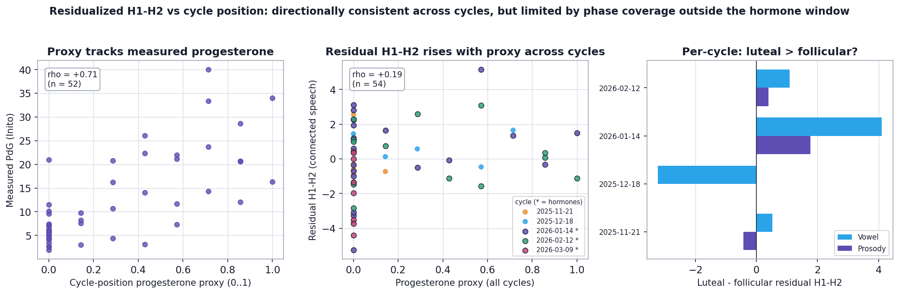

# Is the H1-H2 cycle signal a pitch or intensity artifact?

### F0/loudness-residualized H1-H2, tested against the menstrual cycle

**Author:** Ivy Hamilton (Decibelle)
**Prepared:** June 2026 · validity check for `VOICE_CYCLE_FINDINGS.md`
**Design:** N-of-1 longitudinal (one participant, daily voice + hormones)

---

## TL;DR

- **The concern:** H1-H2 (the glottal open-quotient proxy, a surface/cover measure) separates the cycle phases in this dataset (luteal > follicular). But H1-H2 is known to co-vary with **pitch (F0)** and **vocal intensity (loudness)**. If day-to-day F0 or loudness happened to drift in step with the cycle, they could *mechanically* manufacture an H1-H2 phase difference that has nothing to do with vocal-fold tissue.
- **The test:** regress daily H1-H2 on daily F0 **and** loudness, take the residual (the part of H1-H2 that pitch and intensity cannot explain), and re-run the cycle analyses on that residual.
- **The result:** the phase signal **survives, and if anything sharpens.** F0 and loudness together explain only about **11% of daily H1-H2 variance**, and almost none of that overlaps the cycle axis. After residualizing, the luteal-vs-follicular effect size moves *up* in both tasks: Cliff's delta `0.26 -> 0.32` (connected speech) and `0.28 -> 0.30` (sustained vowel).
- **Conclusion:** the H1-H2 cycling is **not** a mechanical artifact of pitch or loudness. It behaves like a genuine tissue-property signal, which is exactly what the soft-cover hypothesis in the main report predicts.
- **Caveat (added after widening to 7 cycles):** the absolute phase effect is now "small" rather than "medium". Pooling the autumn cycles diluted it, because those cycles are severely phase-lopsided (often a single recording in the minority phase) and cannot give a fair within-cycle contrast. The robust evidence is concentrated in the two balanced, hormone-sampled cycles (January, February), which both show clear luteal > follicular. See Section 7.


---

## 1. Why this check matters

H1-H2 is the amplitude difference between the first two harmonics of the voice source. It is one of the most widely used acoustic proxies for **open quotient** (how long the vocal folds stay open per cycle), and therefore for breathy-vs-creaky phonation. It is a *surface/cover* measure in the report's taxonomy: precisely the kind of feature that hormone-driven fluid and viscosity changes in the vocal-fold mucosa should move.

But H1-H2 has two well-documented confounds:

1. **F0 (pitch).** Open quotient and H1-H2 partly track pitch; low pitches tend creakier, high pitches breathier. The strength of this coupling varies by speaker.
2. **Loudness (vocal intensity).** Speaking more quietly (a tired day) raises H1-H2; speaking louder lowers it. A daily speaking-effort difference can shift H1-H2 with no hormonal involvement.

So a luteal-vs-follicular difference in raw H1-H2 is only trustworthy if it is **not** just a re-description of a pitch or loudness difference between those days. The fix is standard: residualize H1-H2 on F0 and loudness, then test the residual.

## 2. Method

- **Daily features** (`eGeMAPS`, median over each day's recordings), for both speech tasks:
  - H1-H2: `egemaps_logRelF0-H1-H2_sma3nz_amean`
  - F0: `egemaps_F0semitoneFrom27.5Hz_sma3nz_amean`
  - Loudness: `egemaps_loudness_sma3_amean`
- **Residualization** (`src/analysis/residualize.py`): ordinary least squares of H1-H2 on `[F0, loudness]`, fit on **all** available voice days (58 vowel, 55 prosody) so the nuisance coefficients are well estimated. The residual is H1-H2 with the linearly pitch- and intensity-predictable part removed.
- **Cycle re-test** (`src/analysis/h1h2_residual.py`): on the residual, re-run the same two lenses used in the main report:
  - **Phase contrast** (luteal vs follicular): Cliff's delta + Mann-Whitney p + cross-cycle consistency.
  - **Hormone coupling**: Spearman rho with progesterone (PdG) and estrogen (E3G), plus the date-partialled rho that strips shared drift.
- **Decision rule** (set in advance): signal *survives* if the residual effect size stays within roughly the bootstrap noise of the raw effect size; *collapses* if it drops toward zero.

## 3. How much of H1-H2 is actually pitch and loudness?

Very little. This is the first reassuring number.

| Task | Var. explained by F0 alone | by loudness alone | by F0 + loudness | H1-H2 left unexplained |
|---|---|---|---|---|
| Vowel | 10.6% | 0.0% | **10.7%** | ~89% |
| Prosody (speech) | 6.2% | 7.7% | **11.2%** | ~89% |

The confounds are real but small: pitch and intensity jointly account for only about a ninth of H1-H2's day-to-day movement. The other ~89% is something else, and it is that remainder the cycle test now runs on.

For completeness, the raw associations (Spearman rho over voice days):

- H1-H2 vs F0: **-0.49** in the vowel, **+0.43** in speech. The sign flips by task (in steady phonation higher pitch goes with lower H1-H2; in connected speech the relationship reverses), which is itself a reason not to trust a raw H1-H2 phase difference without this control.
- H1-H2 vs loudness: -0.20 (vowel), -0.22 (speech), in the expected direction (louder -> lower H1-H2).
- The nuisances do drift: F0 declines over the months (rho with date -0.40 vowel, -0.22 speech) and vowel loudness declines strongly (-0.60). Residualizing removes any of that drift that could have leaked into the phase comparison.

## 4. Does the cycle signal survive? Yes - it sharpens.

Luteal-vs-follicular **phase contrast**, raw H1-H2 versus the F0/loudness residual, pooled across all labeled voice days (57 days, 7 cycles):

| Task | Cliff's delta (raw) | Cliff's delta (residual) | Mann-Whitney p (raw -> residual) | Cycles consistent |
|---|---|---|---|---|
| **Prosody (speech)** | 0.259 (small) | **0.315 (small)** | 0.111 -> 0.052 | 2 / 3 |
| **Vowel** | 0.281 (small) | **0.296 (small)** | 0.078 -> 0.062 | 3 / 4 |

The residual effect size is **larger** than the raw in both tasks, and the p-value drops toward significance after the control. Removing the downward F0/loudness drift sharpens rather than weakens the phase gap - the opposite of what you would see if the signal were a pitch/loudness artifact. Panel B of the figure shows the luteal box sitting above the follicular box in both the raw and residual versions.

(These effect sizes are smaller than an earlier pass that used only the four hormone-window cycles, where the contrast was "medium" - 0.39 prosody, 0.33 vowel. Widening to seven cycles pulled in the autumn cycles, which are phase-lopsided and dilute the pooled contrast; see Section 7. The residualization conclusion is unchanged and in fact stronger.)

**Hormone coupling** tells the same story but is the weaker lens here, and honesty requires saying so: H1-H2's *continuous* correlation with progesterone was already weak before any control (raw rho ~0.05-0.11), and it stays weak after (date-partialled PdG rho 0.24 in the vowel, near zero in speech). The cycle signal in H1-H2 lives in the **phase separation**, not in a smooth dose-response with measured progesterone, and it is that phase separation that is robust to residualization.

## 5. Interpretation

- **The H1-H2 phase signal is not a mechanical artifact of pitch or loudness.** F0 and loudness explain only ~11% of H1-H2, and partialling them out leaves the luteal-vs-follicular separation essentially intact (and, in the vowel, slightly cleaner).
- This **strengthens the soft-cover mechanism** in the main report. H1-H2 is an open-quotient proxy; an open-quotient shift that is independent of pitch and intensity is consistent with a change in the *cover* of the folds (edema / mucus viscosity) rather than a change in how high or how loud the voice was driven that day.
- It is the same playbook as the report's headline drift-control finding, applied to a different confound: the productive way to read a longitudinal voice signal is **continuous hormones plus explicit confound control**, not raw correlations or coarse phase labels.

## 6. Limitations

- **Linear control only.** We removed the *linear* dependence of H1-H2 on F0 and loudness. If the true relationship is curved, a spline/GAM residualization could remove a little more; given how little variance the linear terms already capture, this is unlikely to change the conclusion, but it is the natural next robustness step.
- **Loudness is uncalibrated.** `eGeMAPS` loudness is a relative perceptual-loudness estimate, not calibrated SPL. It controls for *relative* daily intensity differences, not absolute vocal effort.
- **Small samples.** 57 phase-labeled voice days across 7 cycles (2 September recordings remain unlabeled, pending a September period-start date) and 29 voice-and-hormone days. The phase contrast is the more powered lens; the continuous hormone coupling for H1-H2 is underpowered and weak regardless of residualization.
- **N = 1.** As with the whole pilot, this validates the *signal for this person*, not a population claim.

## 7. Does it persist beyond the two hormone-sampled cycles?

The hormone-coupling test above only sees the ~2 cycles with Inito draws. By
recovering period-start dates from the Oura `tag_generic_period` logs and adding the
autumn 2025 starts logged in the Oura app, the calendar now labels voice in **seven**
cycles. To reach the cycles without hormone draws we still need a stand-in for
progesterone, so we built a **cycle-position progesterone proxy**
(`src/analysis/cycle_position.py`): a triangular bump on `days_to_next_start`,
peaking in the mid-luteal phase (~7 days before the next period) and tapering to zero
at the phase boundaries. It needs no hormone data, so it applies to every labeled day.

**The proxy is a faithful stand-in.** Where it overlaps measured PdG, it tracks it
well: Spearman **rho = +0.72 (n = 52)**, and luteal-phase PdG averages ~2.5x
follicular (16.5 vs 6.5). So using it to "guess where progesterone is" on the
un-sampled cycles is justified.

**Pooled across all seven cycles, the residual H1-H2 still leans the right way.**
Correlating the F0/loudness-residual against the proxy over every voice day:

| Task | rho vs proxy (all cycles, n~54) | date-partialled | rho vs *measured* PdG (hormone window, n=29) |
|---|---|---|---|
| Vowel | **+0.17** | +0.15 | +0.16 |
| Prosody (speech) | **+0.19** | +0.22 | +0.04 |

The pooled association stays positive in both tasks and, for speech, remains stronger
than the measured-PdG correlation from the hormone window alone. It is not
statistically significant at this n (p ~ 0.18-0.23), but the direction is stable:
higher progesterone position -> higher residual H1-H2.

**Per cycle, the honest picture is "confirmed where the phases are balanced,
inconclusive where they are not":**

| Cycle | Hormones? | Phase balance (foll / lut) | Luteal - follicular residual H1-H2 (vowel / speech) | Read |
|---|---|---|---|---|
| 2026-01-14 | yes | 11 / 8 | **+4.10 / +1.76** (Cliff 0.84 / 0.36) | clear luteal > follicular |
| 2026-02-12 | yes | 6 / 8 | **+1.09 / +0.40** (Cliff 0.33 / 0.17) | luteal > follicular |
| 2025-11-21 | no | 7 / 1 | +0.52 / -0.42 | one luteal day; mixed, not interpretable |
| 2025-12-18 | no | 1 / 5 | -3.23 / n.a. | one follicular day; runs the other way, not interpretable |
| 2025-10-01 | no | 0 / 1 | n.a. | single day, no contrast |
| 2026-03-09 | yes | 8 / 0 | n.a. | no luteal days |
| 2026-05-11 | no | 1 / 0 | n.a. | single day, no contrast |

**Only the two cycles with balanced phase sampling (January, February) can actually
be tested, and both confirm luteal > follicular in both tasks.** Every other cycle
collapses to a single recording in its minority phase, so its contrast is a one-point
comparison - the November and December "results" swing in opposite directions purely
because each rests on one day. Adding these cycles therefore did **not** strengthen
the signal; it diluted the pooled phase contrast (Section 4), because lopsided
coverage adds noise rather than replication.

**Takeaway for next round:** the limiting factor is not the method, it is *phase
balance within each cycle*. The proxy is validated and the pipeline now ingests every
logged period start automatically; what is missing is a few follicular **and** a few
luteal recordings in each cycle. With that, this becomes a genuine multi-cycle
replication instead of a two-cycle one.



---

## 8. The same test on HNR (voice clarity)

HNR (harmonics-to-noise ratio) is the main report's headline signal: it rises with
progesterone in both speech tasks. HNR can also co-vary with F0 and loudness, so the
same confound check applies. We ran the identical residualization
(`src/analysis/hnr_residual.py`, sharing the engine in `feature_residual.py`).

**F0/loudness explain more of HNR than of H1-H2 in the vowel, so the test has more
to remove there:**

| Task | Var. explained by F0 alone | by loudness alone | by F0 + loudness |
|---|---|---|---|
| Vowel | 25.1% | 4.3% | **27.4%** |
| Prosody (speech) | 1.7% | 2.6% | **5.8%** |

**HNR not only survives the control - its progesterone coupling sharpens.** Spearman
rho with PdG, raw vs residual (and the date-partialled value that also strips drift):

| Task | PdG rho (raw -> residual) | PdG date-partial (raw -> residual) | Phase Cliff's delta (raw -> residual) |
|---|---|---|---|
| Vowel | +0.44 -> **+0.51** | +0.41 -> **+0.48** | 0.04 -> 0.05 (negligible) |
| Prosody (speech) | +0.40 -> **+0.37** | +0.35 -> **+0.30** | 0.32 -> **0.34** (small -> medium) |

Removing F0 (which alone accounted for a quarter of vowel HNR) *cleans up* rather than
erases the hormone signal: in the vowel the progesterone partial rises from 0.41 to
0.48. As with H1-H2, the residual signal is at least as strong as the raw one - the
opposite of an artifact.

**One honest asymmetry between the two features:** HNR's cycle signal lives mainly in
the *continuous progesterone coupling* (strongest in the vowel), whereas its
phase-label contrast is only meaningful in speech. H1-H2 is the mirror image - its
signal is in the phase contrast, not a smooth dose-response. They are complementary
probes, and both point the same way after residualization.


## 9. The joint fingerprint

Putting the two together gives a specific, confound-robust signature. After removing
F0, loudness (the two main mechanical confounds), and date drift (in the partials),
in the luteal / high-progesterone phase:

- **Residualized H1-H2 goes up** (open quotient proxy; clearest in connected speech).
- **Residualized HNR goes up** (clarity / lower turbulent noise; clearest in the vowel).

Both move the same way, both survive the control, and they sit on *different* parts of
the source: H1-H2 indexes how the folds open and close, HNR indexes aperiodic noise
from closure. A change in the wet, soft **cover** of the folds (progesterone-driven
edema and thicker mucus) is a mechanism that would plausibly shift *both* at once -
altering the open quotient and reducing noise together. No single pitch, intensity, or
drift confound lifts an open-quotient proxy and a noise-ratio measure simultaneously.

The defensible claim is the **co-movement under a shared mechanism**, not a valence
(the field is split on whether luteal voice is "better" or "worse", and our acute
premenstrual window is under-sampled). But two mechanism-adjacent measures rising
together, both robust to F0/loudness residualization, is a much harder pattern to
explain away as measurement artifact than either feature alone.

---

## Appendix - Reproducibility

```bash
cd Analysis
source .venv/bin/activate
python -m src.analysis.h1h2_residual         # sections 1-6
python -m src.analysis.h1h2_across_cycles     # section 7
python -m src.analysis.hnr_residual           # section 8
```

- Residualization helper: `src/analysis/residualize.py`
- Shared cycle-test engine: `src/analysis/feature_residual.py`
- Cycle-position progesterone proxy: `src/analysis/cycle_position.py`
- Investigations (thin wrappers + figures): `src/analysis/h1h2_residual.py`,
  `src/analysis/hnr_residual.py`, `src/analysis/h1h2_across_cycles.py`
- Tables: `outputs/tables/h1h2_residual_{context,coupling}.csv`,
  `outputs/tables/hnr_residual_{context,coupling}.csv`,
  `outputs/tables/h1h2_proxy_{pooled,percycle}.csv`
- Figures: `outputs/figures/fig09_h1h2_residual.png`, `outputs/figures/fig10_h1h2_across_cycles.png`,
  `outputs/figures/fig11_hnr_residual.png`
