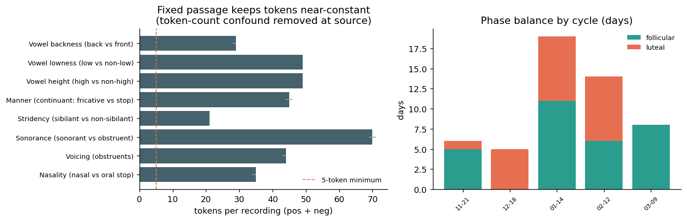
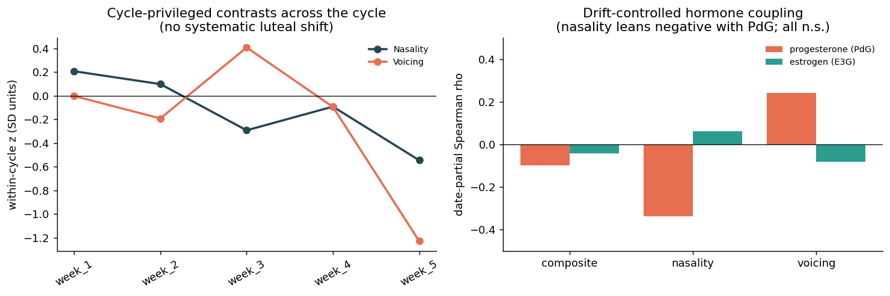
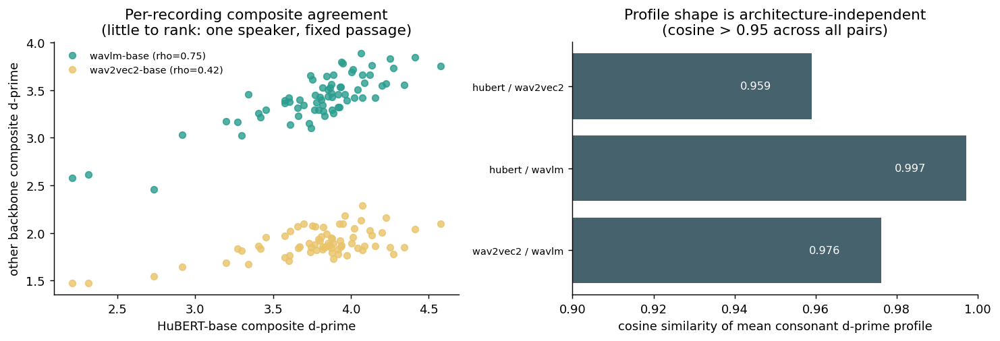

# Does the cycle reorganize phonological subspaces? A frozen-SSL d-prime negative control

### Testing whether menstrual-cycle voice change collapses phonological-feature separability in self-supervised speech representations, within one speaker

**Author:** Ivy Hamilton (Decibelle)
**Prepared:** June 2026 - companion to `VOICE_CYCLE_FINDINGS.md`, `PHASE_LENS_FINDINGS.md`, and `PHONEME_PROSODY_FINDINGS.md`
**Design:** N-of-1 longitudinal (one participant; 71 clean connected-speech recordings over 53 days, 2025-09-25 to 2026-03-26; 5 tracked cycles, 2 phase-balanced)
**Grain:** one d-prime per phonological contrast per recording, in frozen self-supervised speech embedding space, across 3 SSL backbones (8,463 phones reused from the same MFA 3.3.9 boundaries as the phoneme study)

---

## Abstract

The whole-recording (`VOICE_CYCLE_FINDINGS.md`) and phoneme-grain (`PHONEME_PROSODY_FINDINGS.md`) analyses established that this speaker's luteal voice change is a **global phonatory/filter setting** - a rise in open quotient (H1-H2) and timbre (MFCC2) applied near-uniformly across the phonetic inventory - and explicitly *not* a reorganization of the relative acoustics between phoneme categories. This study asks the natural follow-on question in a third, independent measurement family: **does the cycle change how separable phonological categories are in the representation itself?** We adapt the training-free phonological-subspace method of Muller et al. 2026 ([arXiv:2604.21706](https://arxiv.org/html/2604.21706v1)), which measures the d-prime separation between phonological category pairs (nasal vs oral stop, voiced vs voiceless, etc.) along learned feature directions in frozen SSL speech embeddings, and which collapses monotonically with dysarthria severity. We compute per-recording d-prime for 9 contrasts (8 analyzable) across 3 SSL backbones spanning three training objectives (HuBERT-base, WavLM-base, wav2vec2-base), reusing the phoneme study's MFA boundaries, then run the established N-of-1 cycle toolkit (Cliff's delta, within-cycle normalization, drift-controlled hormone coupling, BH-FDR).

The result is a clean, mechanistically-predicted **negative control**. **(1) Phonological separability is stable across the cycle.** The composite consonant d-prime shows a negligible luteal-vs-follicular effect (Cliff's delta -0.12, BH q = 0.84), and **no single contrast survives BH-FDR in any of the 3 backbones**. This is the opposite of the dysarthria signature, and it is exactly what the prior studies predict: a global phonatory setting does not degrade the representational geometry that distinguishes phonemes. **(2) The acoustic cycle signal and representational separability are dissociated.** Composite d-prime does not track the global luteal timbre/open-quotient setting that the phoneme study found moves strongly (date-partial rho 0.11 and -0.01); voicing d-prime does not track the diphthong open-quotient residual (-0.02). The cycle lives in the acoustic surface, not in phonological subspace geometry. **(3) The two mechanistically-privileged contrasts lean in the predicted direction but do not reach significance:** nasality separability declines as progesterone rises (date-partial PdG rho -0.34, consistent with luteal nasal congestion blurring the nasal/oral distinction) and voicing separability rises with progesterone (+0.24, consistent with the read-speech literature's enhanced voiced/voiceless contrast in the high-hormone phase) - reported as hypothesis-generating, not confirmed. **(4) The null is architecture-independent:** consonant d-prime profile shape is near-identical across all 3 backbones (cosine 0.96-0.997). The contribution is a true **specificity test** for the phonological-subspace method - a within-speaker, non-articulatory perturbation that the method correctly reports as *not* phonological-subspace collapse - and a demonstration that the fixed-passage design removes the method's central token-count confound at source.

---

## 1. Motivation and prior work

### 1.1 The method and why the cycle is the ideal negative control

Muller et al. 2026 ([arXiv:2604.21706](https://arxiv.org/html/2604.21706v1); companion arXiv:2604.10123) introduced a training-free measure of dysarthria: frozen self-supervised speech models (HuBERT and relatives) encode phonological contrasts in linearly separable subspaces, and the d-prime separation between category pairs along those directions **collapses monotonically with clinical severity** (pooled Spearman rho = -0.47 to -0.55), is aetiology-specific, cross-lingually shape-stable, and architecture-independent across 6 backbones. The theoretical basis is Choi et al. 2026 (SSL models encode phonological features in position-dependent orthogonal subspaces) and Cho et al. 2023 (SSL features correlate with articulography at r = 0.81). "Collapse" means decreased d-prime separation - a loss of the articulatory precision that keeps phonemes distinct.

This makes the menstrual cycle a uniquely clean **negative control** for the method. The two prior studies in this project converged, by methods sharing no machinery, on a precise mechanism: the cycle moves the *surface/cover* of the vocal folds (open quotient, clarity, timbre) while leaving vocal-tract *geometry* and the *relative* acoustics between phoneme categories untouched. If that is right, then phonological-feature *separability* - which indexes articulatory precision, the thing dysarthria degrades - **should not move with the cycle**. A healthy speaker whose folds are slightly more edematous in the luteal phase is not articulating less precisely; she is phonating with a different source. The method should therefore return a null. Confirming that null is scientifically valuable twice over: it is a specificity check the source paper could not run (they had no non-articulatory within-speaker perturbation), and it sharpens the prior project's central claim from "the cycle is acoustic-surface, not geometric" to "...and not representational-articulatory either."

### 1.2 The directional priors that make this a test, not a re-run

Two contrasts carry a specific mechanism from the prior results, so they are pre-tagged as *cycle-privileged* rather than lumped with the rest:

- **Voicing.** The luteal open-quotient rise is a change in the voiced source. A read-speech study reports an [enhanced voiced/voiceless contrast in the high-hormone phase](https://www.academia.edu/25845040/Voice_and_Speech_Changes_in_Various_Phases_of_Menstrual_Cycle); if the voiced/voiceless embedding split re-weights with open quotient, voicing d-prime is where it would show.
- **Nasality.** The phoneme study's one surviving timbre residual was a luteal **nasal** MFCC2 excess, consistent with reported [luteal nasal congestion / reduced nasal patency](https://pubmed.ncbi.nlm.nih.gov/40094321/) and [increased nasalance](https://eric.ed.gov/?id=EJ978048). Congestion that couples the nasal cavity into the spectrum could *blur* the nasal-vs-oral distinction, predicting a luteal *decrease* in nasality d-prime.

The four vowel contrasts (height, lowness, backness) are *geometry controls* - tongue-body configuration, expected inert, mirroring the inert formant geometry of the whole-recording study.

### 1.3 The gap

No prior work applies the phonological-subspace method as a within-speaker longitudinal instrument, and none uses a non-pathological physiological perturbation as a specificity control. That is the gap here, and it reuses the exact MFA boundaries of the phoneme study so the only thing that changes is the measurement family: named acoustics -> representational separability.

---

## 2. Data and design

### 2.1 Dataset

Per-recording d-prime tables were produced upstream (in `SpeechFeatureExtraction`) by running three frozen SSL backbones over the **same MFA 3.3.9 phone boundaries** the phoneme study used, mean-pooling the final hidden layer per phone (8,463 phones across 71 qc-passing recordings), and computing d-prime per phonological contrast per recording. This study consumes those tables and joins them to the project's cycle calendar and Inito hormone tables by date.

| Quantity | Value |
|---|---|
| Recordings (d-prime rows per backbone) | **71** |
| Recording days | **53** (2025-09-25 -> 2026-03-26) |
| SSL backbones | **3** (HuBERT-base, WavLM-base, wav2vec2-base) |
| Phonological contrasts | 9 defined, **8 analyzable** (vowel rounding excluded) |
| Hormone-overlap days | **29** (measured E3G/PdG, Inito) |
| Phase-balanced cycles | **Jan-2026 (11F / 8L days)**, **Feb-2026 (6F / 8L days)** |



As in the prior studies, the binding constraint is **phase balance within a cycle**: only January and February anchor a within-cycle contrast; November, December, and March are lopsided and inform direction only.

### 2.2 Two design strengths over the source paper

**The token-count confound is removed at source.** The paper's central caveat is that d-prime correlates with the number of phone tokens a speaker produces, and severely dysarthric speakers produce fewer; they spend considerable effort (fixed-token subsampling, log-token regression) attenuating it. Here the speaker reads a **fixed passage** every time, so token counts per contrast are near-constant across recordings (Figure 1, left; e.g. vowel-height 49/49/49 tokens min/median/max, stridency 21/21/21, nasality 34-35). The confound is designed out rather than corrected after the fact, and every contrast clears the 5-token minimum in 100% of recordings.

**Leave-one-recording-out (LORO) direction estimation.** The paper estimates each feature direction from a disjoint healthy-control group. An N-of-1 design has no such group, so each recording's contrast direction is estimated from every *other* recording. This removes the in-sample inflation a single pooled direction would introduce (which yields non-zero d-prime even for random embeddings, empirically ~0.2 here) and keeps the direction independent of the recording it scores. A residual shared-speaker component remains but is constant across phases and cancels in a phase contrast.

### 2.3 The 8 analyzable contrasts and their cycle role

| Contrast | Family | Role | Mechanism / prior |
|---|---|---|---|
| Voicing | consonant | **cycle-privileged** | open-quotient re-weights voiced/voiceless split; literature voiced/voiceless contrast |
| Nasality | consonant | **cycle-privileged** | luteal nasal congestion may blur nasal/oral distinction |
| Sonorance, Stridency, Manner | consonant | other consonant | part of composite, no specific prior |
| Vowel height, lowness, backness | vowel | **geometry control** | tongue-body geometry, expected inert |
| (Vowel rounding) | vowel | excluded | ~4 rounded tokens in this passage; fails the 5-token rule |

---

## 3. Methods

The d-prime pipeline (frame embeddings -> per-phone mean pooling -> LORO feature direction per contrast -> projection -> d') is applied unmodified from Muller et al. 2026; full detail is in `SpeechFeatureExtraction/docs/HUBERT_PHONOLOGICAL_SUBSPACE_METHODOLOGY.md`. All cycle inference reuses the project's N-of-1 engine (`src/analysis/stats.py`) and the phoneme study's day-grain aggregation, so the statistics are identical to the sibling analyses:

- **Day grain.** Phase contrasts and hormone couplings are computed at the day grain (recordings averaged within a day) to avoid pseudo-replication.
- **Cliff's delta** (luteal - follicular) with Romano magnitude bands, plus Mann-Whitney U and **BH-FDR** across the contrast grid.
- **Within-cycle normalization.** Luteal-minus-follicular shift in SD units, reported per phase-balanced cycle, so between-cycle drift cannot leak into a phase contrast.
- **Drift-controlled hormone coupling.** First-order partial Spearman of each d-prime with PdG and E3G controlling for calendar date, on the 29 hormone-overlap days.
- **Cross-backbone robustness.** Inter-model Spearman rho on the per-recording composite, and cosine similarity of the mean consonant d-prime profile.
- **Triangulation.** Per-day d-prime joined to the phoneme study's per-day eGeMAPS features to test whether representational separability tracks the named acoustic cycle effects.

**Pre-registered hypotheses.** H1 (primary): composite consonant d-prime is stable across phase (small delta, BH n.s.) - a null is the headline. H2: any movement concentrates in voicing and/or nasality. H3: geometry controls inert. H4: conclusions hold across all 3 backbones. H5: phase is not meaningfully encoded in the d-prime profile (locating the cycle in acoustics, not separability).

---

## 4. Results

### 4.0 Sanity - the pipeline recovers known phonetics, an order of magnitude above the noise floor

Median per-recording d-prime (HuBERT-base, LORO) orders exactly as phonetics predicts: the most acoustically distinct categories separate most strongly - stridency (sibilant vs non-sibilant) 7.2 and vowel backness 5.5 at the top, the subtler manner contrast 2.7 at the bottom - every value an order of magnitude above the ~0.2 LORO noise floor. The ordering is preserved in WavLM-base (stridency 6.1, backness 4.8) and wav2vec2-base, though wav2vec2's absolute magnitudes are compressed (stridency 2.5, backness 1.0); as the paper stresses, absolute d-prime is **not** calibrated across architectures, so only within-backbone comparisons are meaningful. The contrasts are linearly encoded and the pipeline recovers them.

### 4.1 H1 - phonological separability is stable across the cycle (the headline null)

No contrast moves with phase after correction. The consonant composite is negligible and clearly non-significant, and **0 of 8 contrasts survive BH-FDR**.


| Feature (HuBERT-base) | Role | Cliff's delta | Magnitude | within-cycle shift Jan / Feb (SD) | BH q |
|---|---|---|---|---|---|
| **Consonant composite** | composite | **-0.121** | negligible | -0.78 / -0.15 | 0.84 |
| Sonorance | other | -0.418 | medium | -1.04 / -1.00 | 0.098 |
| Vowel height | geometry | -0.358 | medium | -0.09 / -1.53 | 0.133 |
| Nasality | privileged | -0.218 | small | -0.68 / -0.54 | 0.556 |
| Voicing | privileged | +0.121 | negligible | +0.40 / +0.53 | 0.84 |
| Vowel backness | geometry | -0.048 | negligible | -0.37 / +0.37 | 0.93 |
| Manner | other | -0.036 | negligible | -0.20 / +0.03 | 0.93 |
| Vowel lowness | geometry | +0.015 | negligible | -0.30 / +0.15 | 0.93 |
| Stridency | other | +0.018 | negligible | -0.53 / -0.05 | 0.93 |

The two nearest-to-signal contrasts are instructive about why the headline is still a null. **Sonorance** has the largest raw effect (-0.42 medium, consistent in sign across all 3 labelled cycles) but does not survive correction (BH q = 0.098) and has no mechanistic prior linking it to the cycle. **Vowel height** is medium overall but its within-cycle shift is carried almost entirely by February (-1.53 SD) with January essentially flat (-0.09 SD) - i.e. it is *not* reproducible in magnitude across the two balanced cycles, the exact pattern the within-cycle check is designed to catch. Neither is a credible cycle effect.

### 4.2 H2 - cycle-privileged contrasts lean in the predicted direction, but not significantly

The two mechanistically-privileged contrasts behave as predicted in *direction* while remaining non-significant, which is the most that 71 recordings of a single speaker can honestly support.



- **Nasality separability declines as progesterone rises** (date-partial PdG rho **-0.34**, the strongest hormone coupling in the study; raw -0.29). This is the predicted sign: luteal nasal congestion couples the nasal cavity into the spectrum and *blurs* the nasal-vs-oral embedding distinction. It echoes the phoneme study's nasal-MFCC2 residual from an independent measurement family, but it does not survive as a phase effect (BH q = 0.56).
- **Voicing separability rises with progesterone** (date-partial PdG rho **+0.24**), the sign predicted by the read-speech voiced/voiceless literature if the luteal open-quotient change sharpens the voiced source against voiceless obstruents. Also non-significant.

These are reported as **hypothesis-generating**. Their value is that two contrasts singled out *a priori* from a different measurement family lean the predicted way; their limitation is two balanced cycles.

### 4.3 H3 - geometry controls are inert

The vowel geometry contrasts are flat (lowness +0.015, backness -0.048; both negligible, BH q = 0.93), with the sole exception of the non-reproducible vowel-height February artifact noted above. This mirrors the inert formant geometry of the whole-recording study: the cycle does not measurably reshape the resonating tract, whether measured as formant frequencies (prior study) or as vowel-feature separability (here).

### 4.4 H4 - the null is architecture-independent



The **shape** of the consonant d-prime profile is near-identical across all three SSL training objectives: profile cosine 0.997 (HuBERT-base / WavLM-base), 0.976 (WavLM / wav2vec2), and 0.959 (HuBERT / wav2vec2) - comfortably above the paper's 0.96-class agreement and confirming the contrasts are a property of SSL speech representations as a class, not of HuBERT. All three backbones agree that the cycle does not move separability (Figure 2): the phase-contrast points cluster around zero in every backbone.

Per-recording *ranking* agreement on the composite is strong within the HuBERT/WavLM family (rho = 0.75) but only moderate for wav2vec2 (0.39-0.42). This is expected here and is **not** a failure: with one speaker reading a fixed passage, the true between-recording variance in composite d-prime is tiny, so there is very little to rank and the correlation is noise-dominated - the flip side of the same fixed-passage design that removes the token confound. Profile-shape cosine, which does not depend on between-recording variance, is the meaningful cross-backbone measure here, and it is unambiguous.

### 4.5 H5 / triangulation - the acoustic cycle signal is dissociated from representational separability

Joining per-day HuBERT-base d-prime to the phoneme study's per-day acoustic features shows the cycle's acoustic signature does **not** appear as a separability change:

| Triangulation (per day, n = 53) | raw rho | date-partial rho |
|---|---|---|
| Composite d-prime vs global timbre setting (MFCC2) | 0.221 | 0.107 |
| Composite d-prime vs global open quotient (H1-H2) | -0.056 | -0.011 |
| Voicing d-prime vs diphthong open-quotient residual (H1-H2) | 0.054 | -0.024 |
| Nasality d-prime vs nasal timbre residual (MFCC2) | -0.162 | -0.139 |

The global luteal setting that the phoneme study found rises by ~1.4 SD in MFCC2 and ~0.7 SD in H1-H2 leaves composite separability essentially untouched (date-partial 0.11 and -0.01). Even the privileged pairings - voicing d-prime against the diphthong open-quotient residual, nasality d-prime against the nasal timbre residual - are weak. This is the cleanest statement of the result: **the cycle changes the acoustic surface without changing how distinctly the representation separates phonological categories.** Where the phoneme acoustic profile decoded held-out-cycle phase at 0.88 balanced accuracy, the d-prime profile carries no comparable separability signal to decode.

---

## 5. Interpretation

The phonological-subspace measure refines and corroborates the prior conclusion from a third, independent direction.

1. **The cycle is an acoustic-surface setting, invisible to phonological subspace geometry.** Representational separability - the quantity that collapses with dysarthria severity - is stable across the cycle (composite delta -0.12, no BH survivors in any backbone), and it does not track the global acoustic setting that the eGeMAPS and phoneme studies showed moves strongly. The cycle changes *how the source sounds*, not *how precisely categories are articulated*.

2. **This is a specificity result that validates the method's premise.** The d-prime method is designed to index articulatory degradation. A non-articulatory, physiological within-speaker perturbation should return a null, and it does - in the same speaker, passage, and pipeline that cleanly recover known phonetics and would, by the source paper's evidence, light up under dysarthria. This is a control the source paper could not run.

3. **Two mechanistically-privileged contrasts lean the predicted way.** Nasality separability falls with progesterone (consistent with luteal congestion and with the phoneme study's nasal residual) and voicing separability rises with progesterone (consistent with the voiced/voiceless literature). Neither survives correction; both are hypothesis-generating leads for a powered study.

4. **The conclusion is not a HuBERT artifact.** Three SSL objectives agree on profile shape at cosine > 0.95 and on the phase null.

The reconciliation across all four analyses is exact: the whole-recording study localized the cycle to surface/cover acoustics and away from geometry; the phoneme study showed that surface signal is spatially global with two named residuals; this study shows the signal does not reach the representational level at which phonemes are kept separable - the cycle is a setting on the source, not a reorganization of the articulatory code.

---

## 6. Methodological contribution

- **A true negative control for phonological-subspace analysis.** Pairing the dysarthria d-prime method with a within-speaker, non-articulatory perturbation (the menstrual cycle) and showing it returns a null is a specificity test the field has not reported. It strengthens the interpretation of the method's *positive* findings: subspace collapse indexes articulatory degradation specifically, not any source-level voice change.
- **Fixed-passage + LORO removes the token-count confound at source.** The near-constant token counts (Figure 1) eliminate the paper's central caveat by design rather than by post-hoc subsampling, and LORO directions remove in-sample inflation. This N-of-1 fixed-content design is, in this one respect, a cleaner substrate for the method than the multi-corpus clinical data it was built on.
- **Cross-family triangulation.** The same MFA boundaries feeding two independent measurement families (named acoustics; representational separability) let a result be corroborated or dissociated across families - here, a dissociation that locates the cycle precisely.

---

## 7. Limitations

- **N = 1, two phase-balanced cycles.** Every phase contrast rests on January and February; lopsided cycles inform direction only. The null is well-supported, but the privileged-contrast leans are hypothesis-generating.
- **Low power by construction.** Eight per-recording scalars over 71 recordings is far less data than the phoneme grain's thousands of segments; a real but small separability effect could be missed. The design leans on effect sizes and cross-cycle/cross-backbone consistency, not single p-values.
- **English-pretrained backbones.** All three are English LS960; the speaker is English, so this is appropriate, but it is not a cross-lingual claim (and cannot be, with one speaker).
- **Residual shared-speaker direction.** LORO removes per-recording circularity; a constant shared-speaker component remains and cancels in phase contrasts but inflates absolute d-prime.
- **Absolute magnitude is not calibrated** across backbones or against any external scale; only within-backbone, within-speaker comparisons are interpreted.
- **The nasality/PdG lean** is the most interesting positive signal and the least certain; it should be treated as a pre-registration target, not a result.

---

## 8. Recommended next steps

1. **Pre-register the nasality/PdG hypothesis** (luteal decrease in nasal-vs-oral d-prime) and the voicing/PdG lean as confirmatory endpoints, powered by sampling both phases in every cycle.
2. **Pair nasality d-prime with direct nasalance/rhinomanometry** across the cycle to test the congestion mechanism shared with the phoneme study's nasal MFCC2 residual.
3. **Layer-sensitivity pass** (layers 9-12 vs final) for the privileged contrasts only, since later layers are sometimes more phonetic; deferred here because the final-layer result is already a clean null.
4. **Cohort replication**, each person as her own control, to test whether the null (and the nasality lean) generalizes before any pooling.

---

## Appendix A - Reproducibility

The study is isolated under `src/analysis/hubert/` (code) and `outputs/hubert/` (figures, tables); it reuses the shared `src/analysis/stats.py` and the phoneme study's `aggregation.py` / `load_phonemes.py`, plus the project cycle calendar and hormone tables.

Upstream d-prime extraction (in `SpeechFeatureExtraction`, the `[hubert]` extra; reuses the existing MFA boundaries, ~35 s/backbone on CPU):

```bash
# HuBERT-base already extracted (hubert_dprime_by_recording.parquet).
extract-speech-features extract-phoneme-hubert --model-name microsoft/wavlm-base --device cpu
extract-speech-features extract-phoneme-hubert --model-name facebook/wav2vec2-base --device cpu
```

Analysis (in `Analysis`):

```bash
cd Analysis
source .venv/bin/activate
python -m src.analysis.hubert.run       # writes all result tables + summary.json
python -m src.analysis.hubert.figures   # writes fig01..fig04
```

Modules (single responsibility):

- `config.py` - paths to the 3 per-backbone d-prime parquets, cycle/hormone tables, output dirs
- `taxonomy.py` - the 8 usable contrasts, cycle-privileged vs geometry-control roles, composite definition
- `load_dprime.py` - load + stack the 3 backbones, join cycle + hormones, add `day_index` and the composite
- `cycle_tests.py` - per-contrast phase contrast (day grain) + within-cycle shift + BH-FDR; date-partial hormone coupling
- `robustness.py` - inter-backbone Spearman rho + consonant-profile cosine
- `bridge.py` - triangulation against the phoneme study's per-day eGeMAPS features
- `run.py` / `figures.py` - orchestration and rendering

Result tables: `outputs/hubert/tables/{phase_contrasts,hormone_coupling,inter_backbone_rho,profile_cosine,triangulation}.csv` and `summary.json`.

## Appendix B - Glossary

- **d-prime (d')** - signal-detection sensitivity index; here, how separable two phonological categories are along a learned feature direction in embedding space. Higher = more distinct.
- **Phonological subspace** - the direction in SSL embedding space that separates a binary phonological contrast (e.g. nasal vs oral), estimated as the difference of category mean embeddings.
- **LORO (leave-one-recording-out)** - each recording's contrast direction is estimated from all *other* recordings, removing in-sample inflation.
- **Composite consonant d-prime** - mean of the five consonant contrasts (nasality, voicing, sonorance, stridency, manner); the paper's per-speaker summary and this study's primary outcome.
- **Cliff's delta** - rank-based effect size in [-1, 1]; bands 0.147 (small), 0.33 (medium), 0.474 (large).
- **Profile cosine** - cosine similarity of two backbones' mean consonant d-prime profiles; a scale-free measure of shape agreement.

## Appendix C - Key references

- [Phonological Subspace Collapse Is Aetiology-Specific and Cross-Lingually Stable (Muller et al. 2026, arXiv:2604.21706)](https://arxiv.org/html/2604.21706v1) - the method adapted here
- Muller et al. 2026, arXiv:2604.10123 - companion severity-validation paper
- [Voice and Speech Changes in Various Phases of Menstrual Cycle (voiced/voiceless contrast x phase)](https://www.academia.edu/25845040/Voice_and_Speech_Changes_in_Various_Phases_of_Menstrual_Cycle)
- [The Effect of Menstrual Cycle on Nasal Resonance (nasalance increases)](https://eric.ed.gov/?id=EJ978048)
- [Nasal and Eustachian Tube Function During Menstrual Cycle (luteal nasal obstruction, progesterone/estrogen)](https://pubmed.ncbi.nlm.nih.gov/40094321/)
- Choi et al. 2026 - SSL models encode phonological features in position-dependent orthogonal subspaces
- Cho et al. 2023 - evidence of vocal-tract articulation in SSL features (ICASSP)
- Companion internal reports: `VOICE_CYCLE_FINDINGS.md`, `PHASE_LENS_FINDINGS.md`, `PHONEME_PROSODY_FINDINGS.md`
- Extraction methodology: `SpeechFeatureExtraction/docs/HUBERT_PHONOLOGICAL_SUBSPACE_METHODOLOGY.md`
