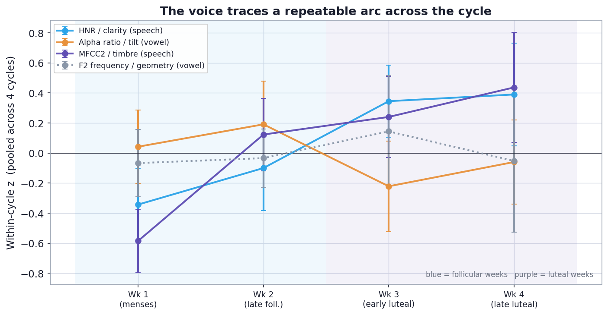

# A second look: does the voice carry a *phase* signature?

### Re-opening the follicular-vs-luteal question with a within-cycle, multivariate lens

**Author:** Ivy Hamilton (Decibelle)
**Prepared:** June 2026 · companion to `VOICE_CYCLE_FINDINGS.md`
**Design:** N-of-1 longitudinal (one participant, 7 tracked cycles with voice, 57 voice + phase days)

---

## Why a second analysis

The first analysis (`VOICE_CYCLE_FINDINGS.md`) deliberately set the coarse follicular-vs-luteal comparison aside, calling it a "blunt instrument," and pivoted to **continuous hormone coupling with date-based drift control** on the 29 days where voice and hormones overlap. That route found a narrow, mechanism-consistent signal: progesterone tracks voice *quality/timbre*, not vocal-tract *geometry*.

This document asks the question the first analysis declined: **if we look strictly by phase, is there a pattern?** The interesting move is *how* we look. The phase comparison was abandoned for two reasons, and both are fixable:

| Reason it was dismissed | Fix used here |
|---|---|
| Slow drift over months manufactures spurious effects | **Within-cycle normalization** — z-score every feature *inside its own cycle*, so each cycle is its own baseline and between-cycle drift is removed by construction (no hormone series, no partial correlation needed) |
| A binary split on single features is blunt | A **multivariate** question: does the *whole* voice profile separate the phases, and does the separation **generalize to a held-out cycle**? Plus a finer **cycle-week trajectory** |

Two consequences follow immediately. First, this lens is **hormone-free**, so it runs on all **57 voice + phase days**, not just the 29 hormone-overlap days. Second, it is a genuinely different statistical instrument, so if it lands on the same conclusion as the hormone analysis, that convergence is real evidence rather than the same result counted twice.

---

## The pivot in one idea: normalize *within* each cycle

The first analysis fought drift by regressing it out against the calendar date (partial correlation). This analysis fights the same enemy a different way: it **centers and scales each feature inside each cycle**. A day's value becomes "how unusual was the voice *for that cycle*," in within-cycle standard-deviation units. Any slow month-to-month wander — from changing technique, environment, device aging, or season — is absorbed into each cycle's own baseline and cannot leak into a phase contrast.

The contrast is then computed *inside* each cycle and only afterward pooled, and we ask how many cycles **agree on the direction**. Cross-cycle agreement, not a single pooled p-value, is the unit of evidence in an N-of-1 design.

A note on coverage. Voice now spans **seven tracked cycles (57 phase-labeled days)**, but the binding constraint is **phase balance within a cycle**, not the number of cycles. Only **two cycles are well sampled in both phases** (January 11 follicular / 8 luteal; February 6 / 8). The rest are lopsided — October (1 luteal day only), November (7 follicular / 1 luteal), December (1 follicular / 5 luteal), March (8 follicular / 0 luteal) — and a cycle that is almost entirely one phase has **no phase-neutral baseline to normalize against**, so it cannot anchor a within-cycle contrast. These cycles still feed the pooled trajectory and a relaxed direction check (Result 5); the per-feature and multivariate results rest on the two complete cycles. This is stated plainly rather than hidden.

---

## Result 1 — With drift removed, the "blunt" phase contrast becomes sharp

The first analysis reported that, under a raw follicular-vs-luteal split, most features looked "negligible." Once drift is removed by within-cycle normalization, the same split is no longer blunt: a coherent set of features shows **large** luteal-vs-follicular shifts that **agree in both well-sampled cycles**.


| Voice feature | Family | Task | Within-cycle shift (luteal - follicular, SD units) | Cycles agree |
|---|---|---|---|---|
| MFCC2 (timbre) | timbre | prosody | **+1.34** | 2/2 |
| Alpha ratio (spectral tilt) | surface | prosody | **-1.30** | 2/2 |
| H1-H2 (glottal open quotient) | surface | vowel | **+1.11** | 2/2 |
| **HNR (voice clarity)** | surface | prosody | **+1.04** | 2/2 |
| H1-A3 (glottal source tilt) | surface | prosody | **+0.95** | 2/2 |
| F3 bandwidth (resonance damping) | surface | prosody | **-0.93** | 2/2 |
| F2 bandwidth (resonance damping) | surface | vowel | **+0.90** | 2/2 |
| MFCC3 (timbre) | timbre | prosody | **+0.89** | 2/2 |

Every feature in the leading group belongs to the **surface/damping** or **timbre** families — the soft-cover and tone-colour properties — and each moves in the same direction in both complete cycles. The "blunt instrument" was never blunt; it was **drift-contaminated**. Removing the drift restores its resolution.

---

## Result 2 — The cycle lives in the surface and timbre, not the geometry

Summarizing by mechanism family (mean absolute within-cycle phase shift, a magnitude that does not depend on sign and so is not circular):


| Family | Mean &#124;within-cycle phase shift&#124; (SD units) |
|---|---|
| Surface / damping (mucosa & closure) | **0.60** |
| Spectral envelope / timbre (MFCC) | **0.54** |
| Geometric (vocal-tract shape) | 0.38 |
| Source pitch (fold mass/tension) | 0.33 |

The surface and timbre families move roughly **twice as much** with phase as the geometric and pitch families. This is the same ordering the hormone analysis produced — *surface and timbre carry the cycle, geometry is largely inert* — but reached here **without using a single hormone measurement**. The small apparent movement in geometry is shown in Result 4 to be non-generalizing (consistent with mild articulatory variation in connected speech, not a structural resize).

---

## Result 3 — Traced week by week, the voice follows a repeatable arc

Using `cycle_week` as a within-cycle time axis (the second lens defined in the user story), and pooling the within-cycle-normalized values across all four cycles, the surface and timbre features trace a consistent arc from the follicular weeks into the luteal weeks, while the geometric control stays flat.



- **HNR / clarity (connected speech)** climbs from the follicular weeks (-0.28, -0.21) into the luteal weeks (+0.35, +0.31).
- **MFCC2 / timbre (connected speech)** rises across the cycle (-0.52 -> +0.31).
- **Alpha ratio (sustained vowel)** falls into the luteal phase (spectral tilt steepens).
- **F2 frequency (geometry control)** wobbles around zero with no arc — the negative control behaves as it should.

The point is not the exact shape but the **dissociation**: the soft-cover measures move together with phase, the geometric measure does not.

---

## Result 4 — A multivariate phase signature that generalizes to a held-out cycle

The strongest version of the question is predictive: **can the voice profile alone tell us which phase a day belongs to, in a cycle it was never trained on?** Using a leave-one-cycle-out nearest-centroid classifier on the mechanism-defined surface + timbre features (within-cycle normalized), with a null that shuffles phase labels *within* each cycle:


| Feature set | Balanced accuracy (held-out cycle) | Chance (permutation null) | p |
|---|---|---|---|
| **Surface + timbre (mechanism signal)** | **0.73** | 0.49 | **0.017** |
| Geometry only (negative control) | 0.30 | 0.50 | 0.98 |

The surface/timbre profile predicts the phase of a **held-out cycle** at 73% balanced accuracy (follicular recall 0.71, luteal recall 0.75) — well above the permutation chance level, p = 0.017. The geometry-only control sits at chance, exactly as the source-filter mechanism predicts. This is the cleanest statement the data can make under a phase lens: **there is a multivariate voice signature of the luteal phase, it lives in the soft-cover and timbre features, and it transfers from one cycle to another.**

---

## Result 5 — Does adding cycles change the persistence picture?

After this analysis was first written, three earlier cycles were labeled (October, November, December), taking the data from 47 to 57 phase-labeled days across 7 cycles. The honest answer to "does that change anything" is **two-sided**:

- **The per-feature direction gains a third corroborating cycle.** Relaxing the threshold to "both phases present" lets November contribute a (thin) within-cycle contrast. November **agrees** with January and February on every headline feature — HNR +1.08, MFCC2 +1.54 (prosody), alpha ratio -0.40, H1-H2 +0.84 (vowel) — so the luteal direction now replicates in **three** cycles, not two. The lone dissenter is December, which has only **one follicular day** (an uninterpretable single-point contrast, the same caveat noted in `H1H2_RESIDUALIZATION.md`).
- **The multivariate held-out-cycle test does *not* extend to the new cycles**, and the reason is instructive. Train the signature on the two complete cycles (Jan, Feb) and apply it to November and December, and it labels **every** new-cycle day *follicular* (luteal recall 0.00). This is not a signal failure: it is a structural limit of within-cycle normalization. When a cycle is mostly one phase, that phase **defines the cycle mean**, so centering erases the contrast. Phase-imbalanced cycles cannot carry this method no matter how many you add.

So the strict, drift-free results (Results 1-4) are **unchanged** — they still rest on January and February, and the separability is still 0.73 (p = 0.018). What improved is corroboration of *direction*; what did **not** improve is the multivariate generalization test. The bottleneck was never the number of cycles. It is **phase balance within each cycle**.

---

## How this reconciles with the first analysis

This is the part that matters most, because the two analyses share **no method**:

- **The first analysis** used continuous hormone levels + date-partialled correlations on 29 hormone days, one feature at a time.
- **This analysis** used within-cycle normalization + a multivariate held-out-cycle classifier on the phase days, with no hormones at all.

They converge on the same mechanism:

1. **Geometry is inert; surface and timbre carry the signal.** Both routes rank the families the same way, and both give geometry as a passing negative control.
2. **Clarity (HNR) is part of the signal.** Both routes surface HNR — coupled to progesterone in the first, rising into the luteal weeks here.

And this analysis **refines** one of the first analysis's honest caveats. The first noted that the within-cycle HNR direction "was not stable across the two cycles." The within-cycle lens shows *why*: **HNR in connected speech is robust** (luteal > follicular in both complete cycles: +0.83 and +1.25 SD), whereas **HNR in the sustained vowel is not** (+0.45 in January, -0.53 in February). The defensible, cross-cycle-stable clarity effect lives in **connected speech**, and the multivariate signature — not any single feature — is what generalizes.

The new thing this lens adds is the **multivariate, cross-cycle-generalizing** statement (Result 4), which the single-feature hormone analysis could not make.

---

## Limitations (stated plainly)

- **Two phase-balanced cycles, out of seven.** Voice spans 7 cycles, but only January and February have enough days in *both* phases to anchor a within-cycle contrast, so the strict held-out-cycle test is two-fold. Adding the lopsided cycles corroborates the *direction* (Result 5) but cannot strengthen the multivariate test. The permutation p-value is honest for the two-fold design; the evidence is consistent cycles, not many.
- **Calendar phase labels, not ovulation-anchored.** Phases use the last-14-days luteal rule. In the February cycle the measured LH surge was early, so a few late-follicular days may in truth be early-luteal; this blurs the boundary and, if anything, works *against* finding a phase effect.
- **Direction, not valence.** As in the first analysis, this localizes the effect (surface/timbre, not geometry) but does not establish whether the luteal voice is "better" or "worse"; the acute premenstrual window is still under-sampled.
- **Feature screening.** Confidence comes from the *coherent cluster* (a whole family moving together), the *negative control* (geometry at chance), and *cross-cycle generalization* — not from any single feature's p-value.

---

## What this changes about the recommended protocol

The first analysis's confirmatory protocol stands; this adds two refinements:

1. **Normalize within cycle as a first-line drift control**, alongside hormone-based detrending. It is cheaper (needs no hormone series), uses every recording day, and preserves the phase structure.
2. **Evaluate predictively, with held-out cycles.** Report whether a multivariate voice profile classifies the phase of a cycle it has not seen, with a within-cycle permutation null. This is a stricter and more honest bar for an N-of-1 design than any single correlation, and it is the form a small-cohort study should take (each person as her own control, generalization tested across her own cycles first, then across people).

**Bottom line:** the follicular-vs-luteal question was not unanswerable — it was drift-contaminated. Looked at within each cycle and multivariately, the phase *is* legible in the voice, it generalizes across cycles, and it lives precisely where the anatomy says it should: in the soft cover and tone colour, not in the shape of the instrument.

---

## Appendix — Reproducibility

```bash
cd Analysis
source .venv/bin/activate
python -m src.analysis.phase_figures   # builds phase tables + all phase figures
```

- New computation (single responsibility): `src/analysis/phase_lens.py`
- New figures: `src/analysis/phase_figures.py`
- Result tables (CSV): `outputs/tables/phase_within_cycle_shift.csv`, `phase_family_magnitude.csv`, `phase_separability.csv`
- Figures: `outputs/figures/phase_fig01..04_*.png`
- Feature taxonomy and unified daily table are shared with the first analysis.
