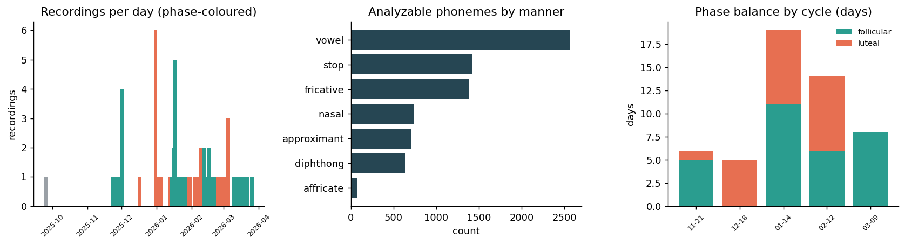
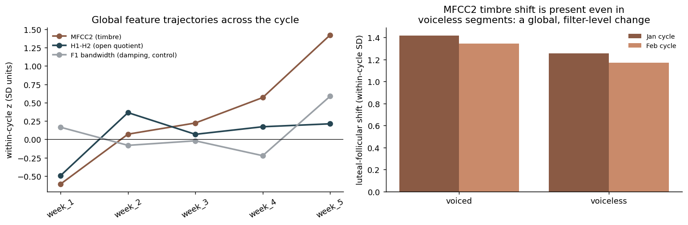
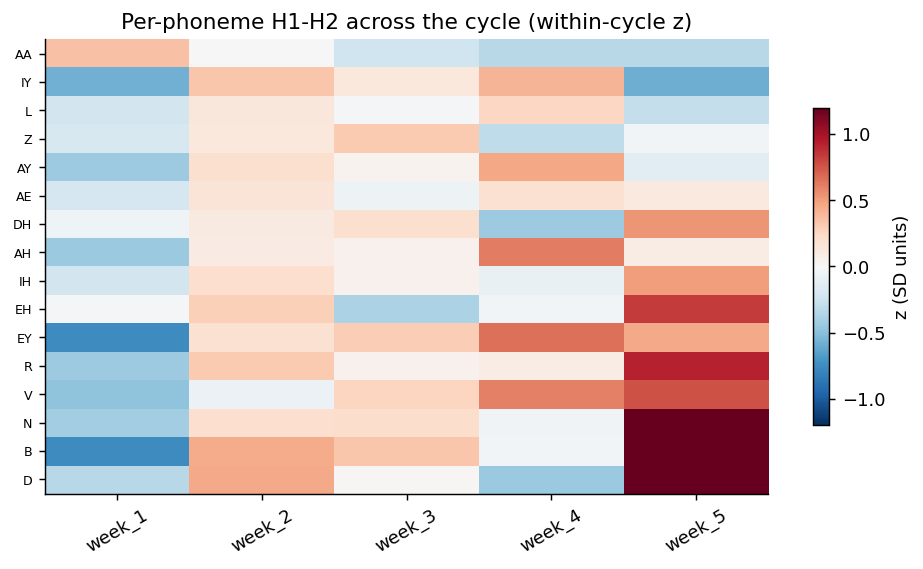
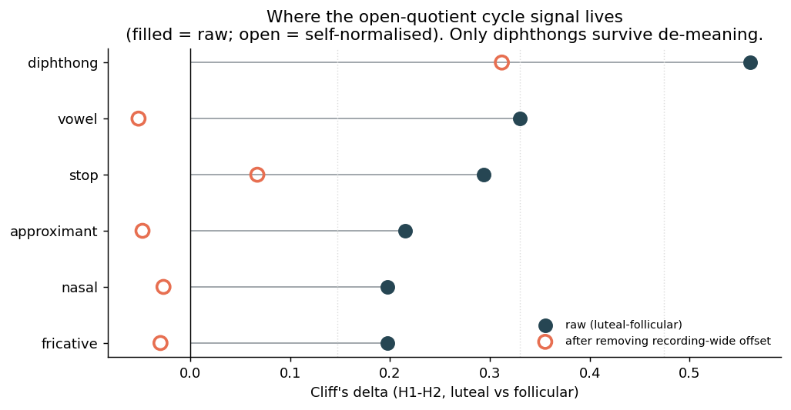
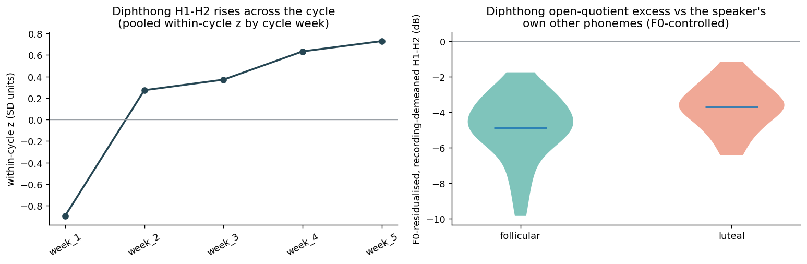
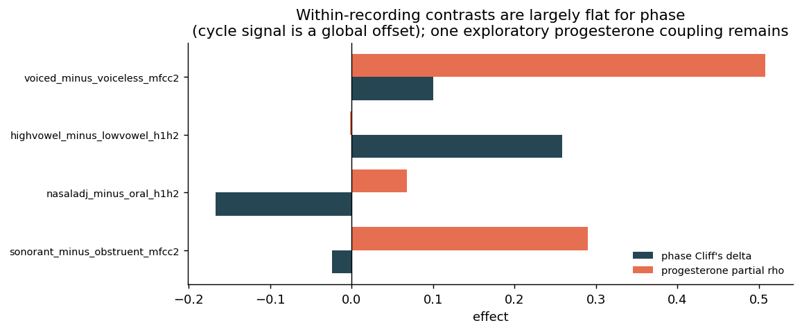
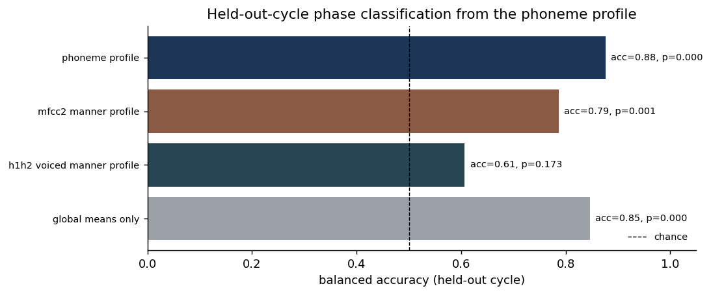

# Where in speech does the cycle live? A phoneme-resolved analysis of connected-speech prosody

### Decomposing read speech to the phoneme grain to localize, and stress-test, a within-subject menstrual-cycle voice signal

**Author:** Ivy Hamilton (Decibelle)
**Prepared:** June 2026 · companion to `VOICE_CYCLE_FINDINGS.md` and `PHASE_LENS_FINDINGS.md`
**Design:** N-of-1 longitudinal (one participant; 71 clean connected-speech recordings over 53 days, 2025-09-25 to 2026-03-26; 5 tracked cycles, 2 phase-balanced)
**Grain:** one row per force-aligned phoneme (8,816 phonemes; MFA 3.3.9), decomposed at three levels — whole recording → articulatory grouping → individual phoneme

---

## Abstract

The whole-recording analyses (`VOICE_CYCLE_FINDINGS.md`, `PHASE_LENS_FINDINGS.md`) established that this speaker's voice carries a luteal-phase signal in *surface/cover* acoustics (open quotient, clarity, timbre) but not in vocal-tract *geometry*. Those measures average one number per recording. This study asks a question that average cannot answer: **does the cycle signal live in specific phonemes, or is it spread uniformly across the phonetic inventory?** We force-aligned the prosody recordings (Montreal Forced Aligner) and recomputed four eGeMAPS low-level descriptors per phoneme, then analyzed them at the phoneme-class and individual-phoneme grain using the established N-of-1 toolkit (Cliff's delta, within-cycle normalization, drift-controlled progesterone coupling, BH-FDR) plus two methods unique to the phoneme grain: **per-recording de-meaning** (subtracting each recording's own mean to ask whether a class effect is just a recording-wide offset) and **within-recording self-normalizing contrasts** (differences between phoneme categories *inside* a recording, which cancel any recording-level confound exactly).

Three findings emerge. **(1) The signal is overwhelmingly global.** Open quotient (H1-H2) and timbre (MFCC2) rise in the luteal phase in essentially every phoneme class, in the same direction, with near-identical within-cycle magnitude in both phase-balanced cycles (MFCC2 ≈ +1.4 SD; H1-H2 ≈ +0.7 SD). De-meaning collapses most class effects to zero, and within-recording contrasts are flat for phase: the cycle acts as a uniform per-recording *setting*, not a reorganization of relative phoneme acoustics. **(2) Two phoneme-selective residuals survive de-meaning and BH-FDR.** The H1-H2 (open-quotient) increase is amplified in **diphthongs** — the longest, most sustained dynamically-voiced nuclei — beyond the recording-wide offset (de-meaned Cliff's delta +0.31; F0-residualized +0.36; BH q = 0.023), and the MFCC2 timbre increase is amplified in **nasals** (de-meaned +0.36; BH q = 0.049), consistent with reported luteal-phase nasal congestion. **(3) The phase is decodable from a held-out cycle** at 0.88 balanced accuracy from the phoneme profile (p = 0.0002), though most of that is carried by the global means (0.85); F1 bandwidth (damping) is a clean phoneme-level null, behaving as a negative control. The methodological contribution is the demonstration that **per-recording de-meaning and within-recording contrasts cleanly separate a global phonatory setting change from phoneme-structured change** — a separation the whole-file pipeline cannot make, and one that resolves a real confound (recording-condition drift) that contaminates longitudinal voice studies.

---

## 1. Motivation and prior work

### 1.1 What the whole-recording study found, and its blind spot

The first two analyses in this project treated each recording as a single feature vector of 88 eGeMAPS functionals and asked whether those features track the menstrual cycle within this one speaker. They converged, by three methods sharing no machinery, on a narrow mechanism: cycle hormones move the *surface/cover* of the vocal folds (open quotient via H1-H2, clarity via HNR, spectral tilt, timbre via MFCCs) while leaving vocal-tract *geometry* (formant frequencies) inert — exactly what the source-filter model predicts if progesterone-driven edema and mucus changes act on the soft fold cover rather than the bony resonating cavities.

That design has a structural blind spot. A whole-recording functional is an average over a heterogeneous mixture of phonemes — vowels, stops, fricatives, nasals — each produced with a different laryngeal and vocal-tract configuration. If the cycle changed only the breathiness of vowels, or only the timbre of nasals, the whole-file average would dilute it; conversely, a whole-file effect could be driven by a single dominant phoneme class and mislabeled as a global voice change. **The grain is wrong for the mechanistic question.**

### 1.2 The literature gap this study targets

The menstrual-cycle voice literature is mixed and almost entirely (i) cross-sectional, (ii) based on sustained vowels, and (iii) computed on whole-utterance summaries. Yet the few hints of *segmental* structure are striking:

- A read-speech study reported a significant **menstrual-phase × plosive-identity interaction** and an **enhanced voiced/voiceless contrast in the high-hormone phase**, concluding that "ovarian hormones play some role in shaping some temporal components of speech" ([Voice and Speech Changes in Various Phases of Menstrual Cycle](https://www.academia.edu/25845040/Voice_and_Speech_Changes_in_Various_Phases_of_Menstrual_Cycle)). This is direct precedent that cycle effects can be *phoneme-class specific*.
- Spectral/cepstral work finds **H1-H2 and cepstral peak prominence differ across phases** (optimal in follicular, deviant in luteal) ([Vocal Changes ... Acoustic, Cepstral, and Spectral Analysis](https://doaj.org/article/9e14d69dd12b4d469cff59a973f3219e)), validating H1-H2 as a cycle-sensitive measure and calling explicitly for **connected-speech** analysis.
- Resonance/upper-airway work reports **increased nasalance during menstruation** ([Effect of Menstrual Cycle on Nasal Resonance](https://eric.ed.gov/?id=EJ978048)) and **reduced nasal patency / increased nasal obstruction in the luteal phase**, correlated with higher progesterone and estrogen ([Nasal and Eustachian Tube Function During Menstrual Cycle](https://pubmed.ncbi.nlm.nih.gov/40094321/); [pilot study](https://pmc.ncbi.nlm.nih.gov/articles/PMC11430933/)). This makes **nasals** a mechanistically privileged phoneme class.
- Methodologically, phone-level forced alignment (MFA) followed by **per-category contrasts** is an established pipeline; phonological-subspace work computes feature directions as the difference between phone-category means and quantifies separation per speaker, requiring a minimum token count per class ([phonological subspace analysis](https://arxiv.org/html/2604.21706v1); [forced alignment review](https://pmc.ncbi.nlm.nih.gov/articles/PMC11449383/)).

No prior work, to our knowledge, combines these into a **dense longitudinal, hormone-anchored, phoneme-resolved** analysis within a single speaker. That is the gap here.

### 1.3 The two questions only the phoneme grain can ask

1. **Localization.** Is the luteal voice-quality shift concentrated in particular phoneme classes (e.g., sustained vowels, nasals, voiced segments), or uniform across the inventory?
2. **Globality vs structure.** Is any apparent class effect simply a recording-wide offset re-expressed at that class, or a genuine change in the *relative* acoustics between phoneme categories? This is also the cleanest available control for recording-condition drift, the confound the first study had to fight with within-cycle normalization.

---

## 2. Data and design

### 2.1 Dataset

Per-phoneme acoustic features were extracted from the prosody (connected-speech) recordings — the Rainbow Passage / read sentences — by force-aligning each WAV with the Montreal Forced Aligner (engine `mfa`, version 3.3.9), assigning each eGeMAPS frame to a phoneme by frame-center timestamp, and aggregating the low-level descriptors over each phoneme's frames. The grain is **one row per aligned phoneme occurrence per recording** (`extractorVersion = phoneme_prosody_v2`).

| Quantity | Value |
|---|---|
| Phonemes (rows) | 8,816 total → **8,463 in clean recordings** → **7,519 analyzable segments** |
| Recordings | 77 total → **71 clean** (`qc_recording_ok`) |
| Recording days | **53** (2025-09-25 → 2026-03-26) |
| Phase-labeled days | **30 follicular / 22 luteal** |
| Hormone-overlap days | **29** (measured E3G/PdG, Inito) |
| Phase-balanced cycles | **Jan-2026 (11F / 8L days)**, **Feb-2026 (6F / 8L days)** |



As in the whole-recording study, the binding constraint is **phase balance within a cycle**: only the January and February cycles have enough days in both phases to anchor a within-cycle contrast. November (5F/1L), December (0F/5L) and March (8F/0L) are lopsided and contribute to pooled and directional checks only. The phoneme grain does not relax this constraint — but it multiplies the evidence *within* each day, because a single recording yields ~36 vowels, ~85 voiced and ~21 voiceless segments (Figure 1, center).

### 2.2 Features and their mechanism mapping

The phoneme extractor exposes four eGeMAPS LLDs aggregated per segment. They map directly onto the source-filter families defined in `feature_taxonomy.py`:

| Phoneme feature | LLD | Mechanism family | Defined on | Unit |
|---|---|---|---|---|
| `segment_h1h2_mean` | H1-H2 | **Surface** (glottal open-quotient / breathiness) | voiced frames only | dB |
| `segment_f1_bandwidth_mean` | F1 bandwidth | **Surface** (resonance damping) | voiced frames only | Hz |
| `segment_mfcc2_mean` | MFCC2 | **Timbre** (low-vs-mid spectral shape) | all frames | unitless |
| `segment_f0_mean` | F0 | **Source pitch** (used as confound covariate) | voiced frames only | semitones |

Critically, three of the four are computed over voiced (F0>0) frames only; their nulls on voiceless consonants are *expected* and are never imputed. `segment_mfcc2_mean` is whole-segment and valid for every phoneme, including voiceless fricatives — a property we exploit to test whether a timbre shift depends on phonation. There is no HNR or formant-frequency feature at this grain, so the geometry negative control is carried here by **F1 bandwidth** and by the absence of phoneme-selective structure.

### 2.3 Grouping axes (the middle analysis level)

Each phoneme carries a deterministic articulatory taxonomy: `phonemeManner` (vowel, diphthong, nasal, approximant, stop, fricative, affricate), `phonemeVoicing` (voiced/voiceless), `phonemeBroadClass` (sonorant/obstruent), and `phonemeHeight` (high/mid/low for vowels). Counts per class are near-constant across clean recordings, so a class × day rollup is well-sampled at the manner and voicing level.

### 2.4 Quality control

Two gates were applied in order, exactly as the handoff prescribes: `qc_recording_ok` first (drops the 6 misaligned recordings whose alignment did not match the expected passage — these inject wrong-label phonemes), then `qc_segment_ok` (≥4 frames / ≥40 ms, required for reliable spectral measures). For the three voiced-only features, rows with null values (voiceless segments) are dropped, not zero-filled.

---

## 3. Methods

All inferential statistics reuse the project's N-of-1 engine (`src/analysis/stats.py`): Cliff's delta with Romano magnitude bands, Mann-Whitney U, first-order partial Spearman controlling for calendar date (drift), and Benjamini-Hochberg FDR. Phase contrasts and hormone couplings are computed at the **day grain** (recordings averaged within a day) to avoid pseudo-replication from multiple recordings per day, matching the house style. Effect sizes and cross-cycle agreement, not single p-values, are the unit of evidence.

Two confound controls are inherited from the whole-recording study, and two are new to the phoneme grain.

- **Within-cycle normalization (inherited).** Z-score each feature inside its own cycle so each cycle is its own baseline; between-cycle drift cannot leak into a phase contrast. Reported as the luteal-minus-follicular shift in SD units, per balanced cycle.
- **Date-partial progesterone coupling (inherited).** Partial Spearman of a feature with PdG controlling for date, on the 29 hormone-overlap days.
- **Per-recording de-meaning (new).** Subtract each recording's own mean of a feature (its recording-wide *setting*) and re-run the per-class phase contrast on the residual. If a class effect is just a global offset reproduced at that class, de-meaning sends it to zero; if a class genuinely changes *relative to the speaker's own other phonemes in the same breath*, it survives.
- **Within-recording contrasts (new).** Form a contrast inside each recording — e.g. (voiced − voiceless) MFCC2, (high − low vowel) H1-H2 — so any recording-wide offset (mic gain, distance, level, technique, slow drift) cancels exactly. A surviving phase/hormone effect on a contrast is necessarily a change in the relative acoustics between categories. This is a stricter confound control than the whole-file series can express.

Finally, a **leave-one-cycle-out nearest-centroid classifier** (within-cycle-normalized day profiles, within-cycle label-shuffling null, 5,000 permutations) tests whether the phase of a *held-out cycle* is decodable, and whether the phoneme *profile* beats a global-means-only baseline.

---

## 4. Results

### 4.0 Validation — the phoneme grain reproduces the whole-file pipeline

Aggregating each phoneme feature back to the day grain and correlating with the independently-produced whole-file eGeMAPS prosody features gives near-identity for the source measures and strong agreement for bandwidth:

| Phoneme feature (day mean) | Whole-file eGeMAPS | Pearson r | Spearman rho | n days |
|---|---|---|---|---|
| H1-H2 | `prosody_...logRelF0-H1-H2_amean` | **0.97** | 0.96 | 53 |
| F0 | `prosody_...F0semitone_amean` | **0.94** | 0.94 | 53 |
| F1 bandwidth | `prosody_...F1bandwidth_amean` | 0.68 | 0.81 | 53 |

The phoneme extractor and the production pipeline measure the same thing, so the phoneme-level results inherit the whole-file study's trust rather than starting from scratch.

### 4.1 The cycle signal is overwhelmingly global across the inventory

Open quotient (H1-H2) and timbre (MFCC2) rise in the luteal phase in **every** voiced manner class, in the same direction, and the within-cycle-normalized shift is large and **near-identical in both phase-balanced cycles**:

| Feature (within-cycle shift, luteal − follicular) | Jan cycle | Feb cycle |
|---|---|---|
| MFCC2 (timbre), voiced segments | **+1.42 SD** | **+1.34 SD** |
| MFCC2 (timbre), voiceless segments | **+1.26 SD** | **+1.17 SD** |
| H1-H2 (open quotient), voiced segments | **+0.77 SD** | **+0.71 SD** |
| F1 bandwidth (vowels; damping control) | +0.31 SD | **−1.07 SD** (sign flips) |



Two things follow. First, that MFCC2 moves by ~1.2 SD even in **voiceless** segments — which carry no vocal-fold vibration — shows that the timbre shift is a **global, filter-level spectral re-coloring**, not a purely phonatory effect; it is therefore also the channel most exposed to recording-condition confounds, and it carries the strongest monotonic time drift of any feature (Spearman vs date +0.44). Second, F1 bandwidth fails the within-cycle consistency check (sign flips between cycles), behaving as the negative control should.

The per-phoneme heatmap makes the globality concrete: nearly every reliably-voiced phoneme shifts from negative (follicular weeks) to positive (luteal weeks) in within-cycle H1-H2 units.



### 4.2 De-meaning localizes a phoneme-selective open-quotient residual to diphthongs

The decisive test is whether any class effect survives removal of the recording-wide offset. For H1-H2, the raw per-class luteal-vs-follicular Cliff's deltas are all positive (vowel +0.33, diphthong +0.56, stop +0.29, approximant +0.22, nasal +0.20, fricative +0.20), but **de-meaning collapses every class to ~0 except diphthongs**:



| Manner | Raw Cliff's delta | After de-meaning | BH q |
|---|---|---|---|
| **diphthong** | **+0.561 (large)** | **+0.312** | **0.023** |
| vowel | +0.330 (medium) | −0.052 | 0.130 |
| stop | +0.294 (small) | +0.067 | 0.170 |
| approximant | +0.215 (small) | −0.048 | 0.297 |
| nasal | +0.197 (small) | −0.027 | 0.312 |
| fricative | +0.197 (small) | −0.030 | 0.312 |

Diphthongs are the only class whose H1-H2 rises *relative to the speaker's own other phonemes in the same recording*, and it is the only class surviving BH-FDR across the whole feature × class grid (q = 0.023). Mechanistically this is the expected signature of an open-quotient change: diphthongs are the longest, most sustained, dynamically-voiced nuclei, where a more open glottal cycle has the most room to express itself.

The residual is **not a pitch artifact.** Regressing every voiced segment's H1-H2 on its own F0 removes only 9.7% of the variance, and on the F0-residualized, recording-demeaned signal the diphthong effect is undiminished (Cliff's delta **+0.36, medium**) while all other manners stay negligible. The within-cycle trajectory of diphthong H1-H2 climbs monotonically from the follicular weeks into the luteal weeks (pooled), agreeing in both balanced cycles (+1.16, +1.14 SD).



### 4.3 MFCC2: a progesterone-coupled global timbre shift with a nasal-selective residual

At the recording-wide level, MFCC2 is the one feature that **couples with progesterone and survives drift control** (date-partial PdG rho **+0.33**, raw +0.37; estrogen +0.12 after drift), echoing the whole-recording study's progesterone→timbre/clarity result. By contrast, recording-wide H1-H2 does **not** couple with continuous PdG (partial −0.05) despite its clear phase effect — a dissociation suggesting the open-quotient shift is tied to phase state (cumulative luteal tissue change) more than to the daily progesterone level.

Like H1-H2, most of the MFCC2 class effects vanish on de-meaning — except **nasals**, which retain a phoneme-selective timbre excess (raw +0.50 large; de-meaned **+0.36**; within-cycle +1.42/+1.39 SD; BH **q = 0.049**). This is the second surviving residual, and it lines up with the upper-airway literature: the luteal phase is associated with **nasal mucosal swelling and reduced nasal patency** driven by progesterone/estrogen, and with **increased nasalance**. Nasal murmurs, which couple the (congested) nasal cavity into the spectrum, are exactly where a luteal resonance change should concentrate. The nasal MFCC2 residual is thus mechanistically coherent rather than incidental, though it rests on the two balanced cycles and is reported as a localized, hypothesis-generating result.

### 4.4 F1 bandwidth (damping) is a clean phoneme-level null

No manner class shows a consistent F1-bandwidth phase effect: within-cycle shifts flip sign between the two balanced cycles for diphthong, nasal, stop and vowel, and all BH q-values exceed 0.29. Damping, as measured by F1 bandwidth at this grain, behaves as a negative control — consistent with the whole-recording finding that bandwidths were the weakest of the surface measures.

### 4.5 Within-recording contrasts confirm the signal is a global offset, not a category reorganization

If the cycle reorganized the *relative* acoustics between phoneme categories, within-recording contrasts would move with phase. They do not:



| Contrast (within recording) | Phase Cliff's delta | Cross-cycle consistent | PdG partial rho |
|---|---|---|---|
| voiced − voiceless (MFCC2) | +0.10 (negligible) | yes | **+0.51** |
| high − low vowel (H1-H2) | +0.26 (small) | yes | −0.00 |
| nasal-adjacent − oral vowel (H1-H2) | −0.17 (small) | yes | +0.07 |
| sonorant − obstruent (MFCC2) | −0.02 (negligible) | no | +0.29 |

The phase contrasts are essentially flat — the cycle acts as a uniform per-recording setting, which is precisely why the whole-file averages were able to detect it and why per-recording de-meaning erased most class effects. One exploratory exception stands out: the **voiced − voiceless MFCC2 contrast couples with progesterone** (date-partial rho **+0.51**, the strongest hormone coupling in the study) even though its binary phase split is flat — hinting that the timbre shift is marginally phonation-weighted when measured against continuous hormone level. With n = 29 days and an inconsistent relationship to the binary phase split, this is flagged as hypothesis-generating, not a headline.

A second phoneme-grain-only quantity, **within-recording vowel-to-vowel dispersion** of H1-H2, *decreases* in the luteal phase (Cliff's delta −0.25, consistent in both cycles): the open quotient becomes more uniform across vowels — the homogenization one would expect if a single global "setting" is being applied to the whole phonatory system.

### 4.6 The phase of a held-out cycle is decodable, mostly from the global component

A leave-one-cycle-out nearest-centroid classifier on within-cycle-normalized day profiles transfers across cycles:



| Feature set | Balanced accuracy (held-out cycle) | Chance | p |
|---|---|---|---|
| **Full phoneme profile** (H1-H2 ×4 + MFCC2 ×6 manners) | **0.88** | 0.50 | **0.0002** |
| Global means only (H1-H2, MFCC2) | 0.85 | 0.50 | 0.0004 |
| MFCC2 manner profile (×6) | 0.79 | 0.49 | 0.0006 |
| H1-H2 voiced-manner profile (×4) | 0.61 | 0.50 | 0.173 |

The phase is highly decodable (0.88), but the phoneme profile beats the two-number global-means baseline by only +0.03 — quantitatively confirming that **most of the predictive signal is the global component**, with phoneme structure (chiefly the diphthong and nasal residuals) adding a small increment. MFCC2 carries more of the decode than H1-H2, consistent with its larger magnitude and global reach.

---

## 5. Interpretation

The phoneme decomposition refines, rather than overturns, the whole-recording conclusion, and it does so by answering the grain question directly.

1. **The luteal voice-quality change is a global phonatory/filter setting, applied near-uniformly across the phonetic inventory.** Both the open quotient and the timbre rise together in nearly every phoneme class, with matched within-cycle magnitude in two independent cycles, and the within-recording contrasts that would reveal a category reorganization are flat. This is a stronger statement than the whole-file average could make: the effect replicates across ~35 phoneme types within the same recordings, which is a far more demanding internal replication than a single utterance-level number.

2. **On top of that global setting sit two mechanistically-coherent, phoneme-selective residuals.** The open-quotient increase is amplified in **diphthongs** (the most sustained dynamic voicing) and survives both de-meaning and F0 control; the timbre increase is amplified in **nasals**, matching independent evidence of luteal nasal congestion. These are the genuinely new, phoneme-grain-only findings, invisible to whole-file or even per-class-global analysis.

3. **MFCC2 is the cycle's most decodable channel but its least mechanistically clean one.** It couples with progesterone after drift control, yet it shifts even in voiceless segments and carries the strongest time drift — so its globality is partly a spectral re-coloring (plausibly upper-airway/nasal and partly recording-condition) rather than a pure vocal-fold cover effect. H1-H2, weaker in the decode, is the cleaner phonatory measure: low drift, voicing-graded, diphthong-localized, F0-independent.

4. **Damping (F1 bandwidth) is inert at the phoneme grain**, reinforcing the negative-control logic that the cycle does not measurably resize or re-damp the resonating tract.

The reconciliation with the whole-recording study is exact: that study localized the cycle to surface/cover acoustics (H1-H2, HNR, timbre) and away from geometry; this study shows *that same surface signal is spatially global across phonemes, with open-quotient amplification in sustained voicing and timbre amplification in nasals*, and provides the tool (de-meaning / contrasts) to prove the globality rather than assume it.

---

## 6. Methodological contribution

The transferable result is not any single effect size; it is a **grain-aware confound protocol** for longitudinal voice biomarkers:

- **Per-recording de-meaning** distinguishes a global per-recording offset from a phoneme-structured change. Any longitudinal study that reports a phoneme- or segment-class effect without this control cannot tell the two apart — and most apparent class effects here were, in fact, the global offset re-expressed.
- **Within-recording contrasts** provide a confound control strictly stronger than within-cycle normalization: they cancel *every* recording-level nuisance (gain, distance, level, technique, drift) by construction, at the cost of needing many phonemes per recording — which connected speech supplies and sustained vowels do not. This is a concrete reason to prefer connected-speech tasks for cycle work, echoing the literature's repeated call to move beyond vowel phonation.
- The combination cleanly attributes this speaker's cycle signal to a **global phonatory setting** plus **two named phoneme residuals**, a decomposition no whole-file pipeline can produce.

---

## 7. Limitations

- **N = 1, two phase-balanced cycles.** The de-meaning, residualization, and held-out-cycle results rest on January and February; lopsided cycles corroborate direction only. The permutation p-values are honest for the two-fold design, but the evidence is *consistent cycles*, not many.
- **No HNR or formant-frequency at this grain.** The geometry negative control is carried by F1 bandwidth and by the absence of phoneme-selective structure, not by formant frequencies as in the whole-file study.
- **MFCC2 globality is partly confoundable.** Its presence in voiceless segments and its strong time drift mean part of the global timbre shift may be upper-airway/nasal coloring or recording condition; within-cycle normalization protects against monotonic drift but not against a within-cycle technique pattern correlated with phase.
- **Calendar phase labels, not ovulation-anchored.** The last-14-days luteal rule can misplace the boundary in long cycles, which works against finding an effect.
- **The diphthong and nasal residuals are localized but single-subject.** They are mechanistically coherent (open quotient in sustained voicing; nasalance/congestion in nasals) and survive BH-FDR, but require replication across people and cycles.

---

## 8. Recommended next steps

1. **Add HNR and formant frequencies to the phoneme extractor** so the full source-filter taxonomy — including the geometry negative control — is available at the phoneme grain.
2. **Pre-register the two phoneme residuals** (diphthong H1-H2 open quotient; nasal MFCC2 timbre) as confirmatory hypotheses, with the diphthong contrast and a nasal-vs-oral resonance contrast as primary endpoints.
3. **Sample both phases in every cycle**, the single highest-value change; the phoneme grain then makes every within-recording contrast a multi-cycle instrument.
4. **Adopt the grain-aware protocol as standard:** per-recording de-meaning and within-recording contrasts alongside within-cycle normalization and drift-controlled hormone coupling.
5. **Test the nasal-congestion hypothesis directly** by pairing nasalance/rhinomanometry with the nasal MFCC2 residual across the cycle.
6. **Scale to a small cohort**, each person as her own control: replicate the global setting + diphthong/nasal residual structure within each woman's own cycles before pooling across people.

---

## Appendix A — Reproducibility

The study is isolated under `src/analysis/phoneme/` (code) and `outputs/phoneme/` (figures, tables); it reuses the shared `src/analysis/stats.py` and the project's cycle calendar and hormone tables.

```bash
cd Analysis
source .venv/bin/activate
python -m src.analysis.phoneme.run       # writes all result tables + coverage summary
python -m src.analysis.phoneme.figures   # writes fig01..fig07
```

Modules (single responsibility):

- `config.py` — paths (phoneme parquet, cycle calendar, hormone tables, outputs)
- `load_phonemes.py` — load + QC gates (`qc_recording_ok`, `qc_segment_ok`) + cycle/hormone join
- `taxonomy.py` — feature→mechanism mapping, grouping axes, within-recording contrast specs
- `aggregation.py` — day/recording series + within-cycle normalization
- `bridge.py` — Level 1 validation vs whole-file eGeMAPS + global drift/hormone coupling
- `localization.py` — Level 2 per-class phase contrast, de-meaning, within-cycle shift, BH-FDR
- `residual_segments.py` — segment-level F0 residualization of H1-H2 (diphthong test)
- `contrasts.py` — within-recording contrasts + dispersion
- `multivariate.py` — leave-one-cycle-out nearest-centroid classifier + permutation null
- `run.py` / `figures.py` — orchestration and rendering

Result tables: `outputs/phoneme/tables/{bridge_validation,global_coupling,localization,diphthong_f0_residual,within_recording_contrasts,dispersion,multivariate_classifier}.csv` and `summary.json`.

## Appendix B — Glossary

- **H1-H2** — amplitude difference of the first two glottal harmonics; a proxy for **open quotient** (how long the folds stay open per cycle): higher = more open / breathier.
- **MFCC2** — second mel-frequency cepstral coefficient; a compact descriptor of low-vs-mid spectral shape ("tone colour"), defined for voiced *and* voiceless segments.
- **F1 bandwidth** — the energy loss (damping) of the first vocal-tract resonance.
- **Diphthong** — a gliding vowel (e.g., /aɪ/, /eɪ/); the longest, most dynamically-voiced nuclei in the inventory.
- **Within-cycle normalization** — z-scoring a feature inside each cycle so the cycle is its own baseline (removes between-cycle drift).
- **Per-recording de-meaning** — subtracting a recording's own feature mean, isolating change *relative to the speaker's other phonemes in the same recording*.
- **Within-recording contrast** — a difference between phoneme categories computed inside one recording; cancels all recording-level confounds.
- **Cliff's delta** — rank-based effect size in [−1, 1]; bands: 0.147 (small), 0.33 (medium), 0.474 (large).
- **Partial Spearman (date)** — rank correlation after removing shared slow drift over calendar time.
- **Balanced accuracy (held-out cycle)** — mean of follicular and luteal recall when predicting the phase of a cycle the model never trained on; chance ≈ 0.5.

## Appendix C — Key references

- [Voice and Speech Changes in Various Phases of Menstrual Cycle (plosive identity × phase; voiced/voiceless contrast)](https://www.academia.edu/25845040/Voice_and_Speech_Changes_in_Various_Phases_of_Menstrual_Cycle)
- [Vocal Changes ... Acoustic, Cepstral, and Spectral Analysis (H1-H2, CPP differ by phase)](https://doaj.org/article/9e14d69dd12b4d469cff59a973f3219e)
- [The Effect of Menstrual Cycle on Nasal Resonance (nasalance increases in menstruation)](https://eric.ed.gov/?id=EJ978048)
- [Nasal and Eustachian Tube Function During Menstrual Cycle (luteal nasal obstruction, progesterone/estrogen)](https://pubmed.ncbi.nlm.nih.gov/40094321/)
- [Nasal/Eustachian patency across cycle phases — pilot study](https://pmc.ncbi.nlm.nih.gov/articles/PMC11430933/)
- [Phonological subspace analysis (phone-level MFA + category contrasts / d-prime)](https://arxiv.org/html/2604.21706v1)
- [Forced alignment review (MFA methodology)](https://pmc.ncbi.nlm.nih.gov/articles/PMC11449383/)
- [Daily smartphone voice across the cycle (F0 changepoints)](https://formative.jmir.org/2025/1/e65448/PDF)
- [Voice across the cycle in natural vs hormonal-contraceptive users (vowel phonation; calls for connected speech)](https://pmc.ncbi.nlm.nih.gov/articles/PMC5568722/)
- [Blood plasma hormone-level influence on vocal function](https://pmc.ncbi.nlm.nih.gov/articles/PMC7842117/)
- Companion internal reports: `VOICE_CYCLE_FINDINGS.md`, `PHASE_LENS_FINDINGS.md`
