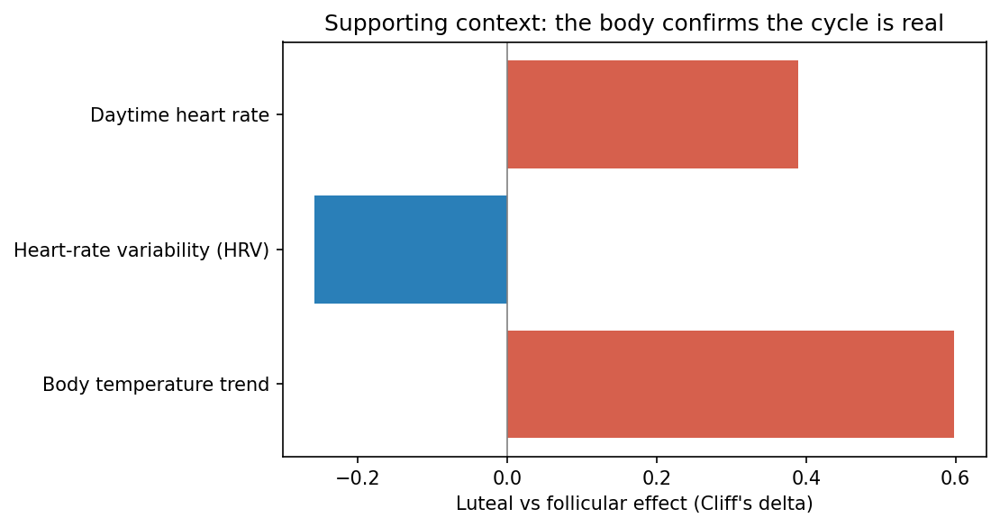
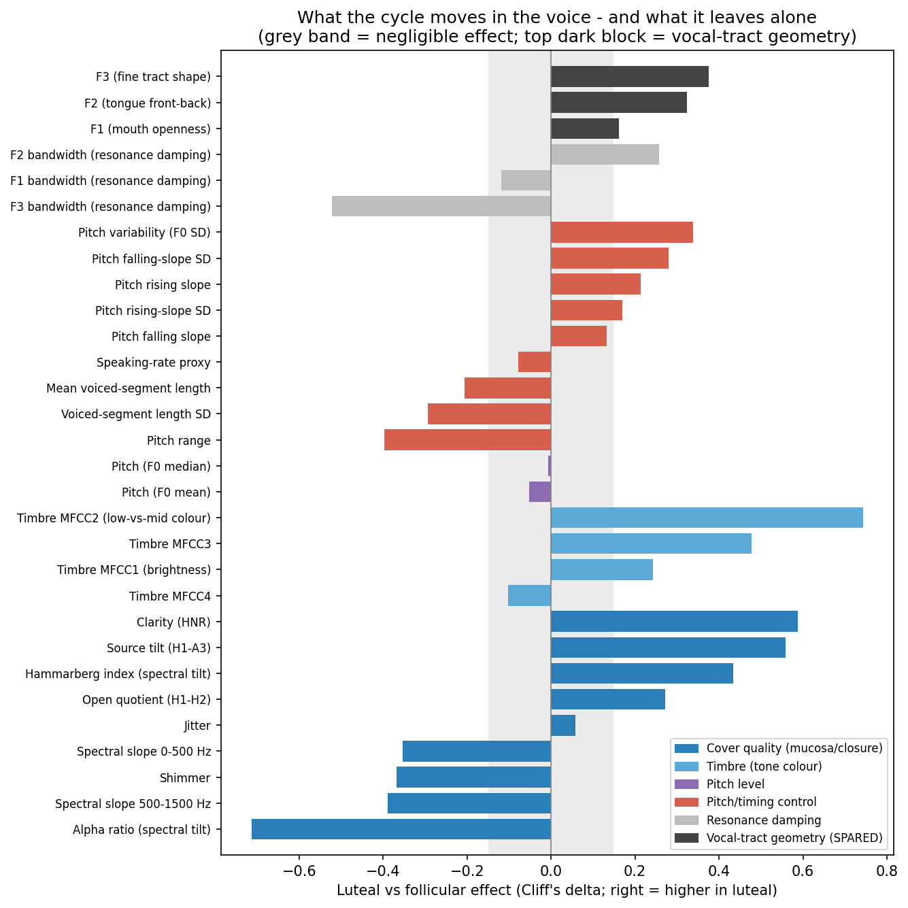
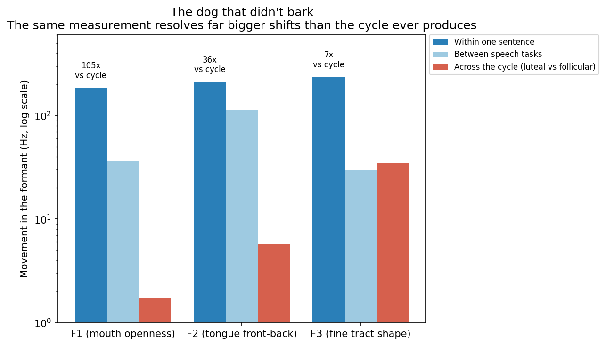
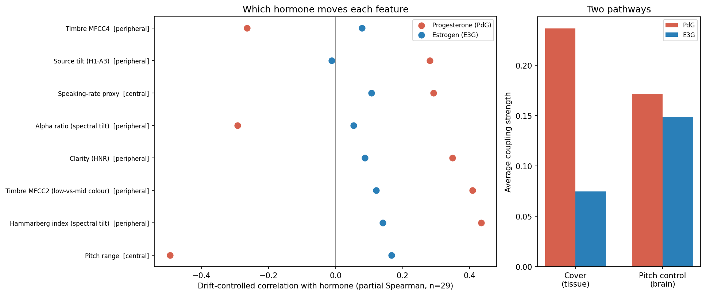
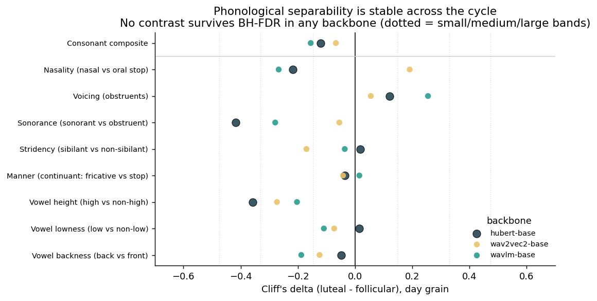
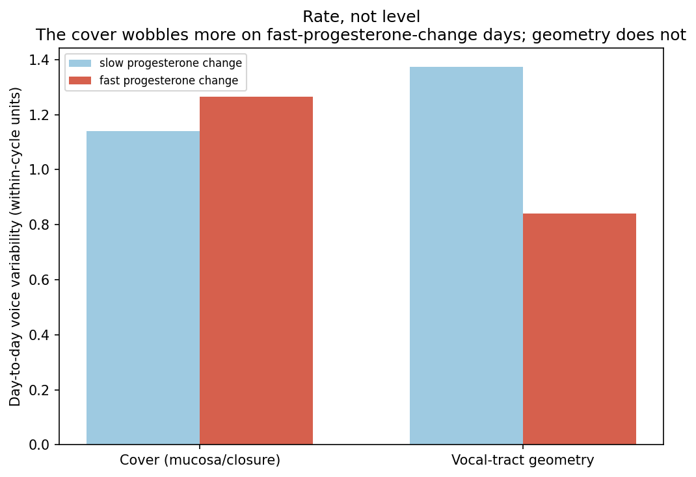
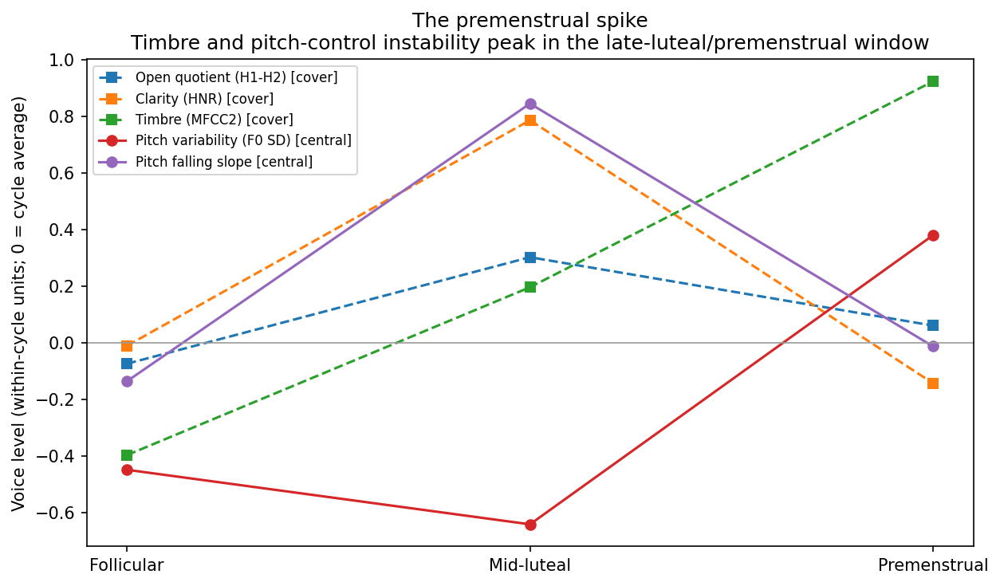

# Where in the voice does the menstrual cycle live?

### A single-subject, hormone-anchored acoustic investigation of voice as a non-invasive window into hormonal and neuro-hormonal health

**Ivy Hamilton — Decibelle** · June 2026

---

## The one-sentence story

> In one woman tracked daily for nine months, the menstrual cycle leaves a **specific, mechanism-coherent fingerprint** on the voice: it retunes the **source** — the soft, wet cover of the vocal folds, driven by **progesterone** — while leaving the **filter**, the geometry of the throat and mouth, untouched. The signal is loudest in the **premenstrual window**, and it appears to act in **two places at once**: the throat tissue *and* the brain's control of pitch.

Everything that follows is built to earn that sentence, and to be honest about where it is solid and where it is a promising lead.

---

## 1. The question, and why the field can't agree

The larynx is a hormone-sensitive organ. The vocal folds are layered structures with a stiff body and a soft, wet **cover** (the mucosa) studded with [estrogen and progesterone receptors](https://pmc.ncbi.nlm.nih.gov/articles/PMC9442059/). Through those receptors the cycle changes how much fluid the cover holds and how thick its mucus is. About a third of women report [premenstrual vocal symptoms](https://www.sciencedirect.com/science/article/abs/pii/S0892199708001690) — vocal fatigue, reduced range, congestion of the folds.

And yet the research literature is a mess. Some studies find jitter up and clarity down premenstrually; a careful [high-speed vocal-fold imaging study](https://www.sciencedirect.com/science/article/abs/pii/S0892199716301631) finds *no* significant change. The disagreement is not random — it is **methodological**:

1. Most studies use **coarse phase labels** ("follicular" vs "luteal") instead of **measured hormones**.
2. Most are **cross-sectional** — different women per phase — so person-to-person noise swamps the within-person effect.
3. Most use **one speech task** and one feature in isolation.
4. **None** control for **slow drift** in a longitudinal signal, nor for the **pitch/loudness confounds** that contaminate source-quality measures.

This project was designed to fix all four — in a single person, measured densely, against her real hormones, with several independent methods so that no single method's blind spot decides the answer.

### The 30-second mental model: the voice is a wind instrument

| Part | Anatomy | What it is | How we measure it |
|---|---|---|---|
| **The reed** | Vocal folds (the buzzing source) | How wet / swollen / stiff the folds are changes the *quality* of the buzz | Open quotient (H1-H2), clarity (HNR), spectral tilt, timbre (MFCCs) |
| **The tube** | Throat & mouth (the resonating filter) | Its *size and shape* turn the buzz into vowels | Formant frequencies (F1, F2, F3) |

> **The mechanistic question, in instrument terms:** when hormones change across the month, do they retune the *reed* (the soft, wet cover) or reshape the *tube* (the cavities)?

This framing is the spine of the whole project, and it gives us a built-in **negative control**: if the driver is fluid/mucus in the fold cover, geometry should *not* move. A theory that predicts where the signal *won't* appear is far more falsifiable than one that only predicts where it will.

---

## 2. The data — and why it is unusual

- **Voice** recorded on **59 days** over ~9 months: a sustained vowel (isolates the larynx) and read sentences (adds articulation and intonation).
- **Measured hormones** at home almost daily for two months (Inito): **E3G** (an estrogen metabolite) and **PdG** (a progesterone metabolite).
- **The body** (Oura ring): temperature, heart rate, heart-rate variability.
- All aligned on the calendar, with **two cycles (January, February) sampled in *both* phases** — the part that anchors every within-cycle test.

Why this matters: the most similar published study, [Kervin et al. 2025](#further-reading) (a daily voice diary across 10 cycles in one singer), named its single biggest gap as **measured hormones**. This project has them. In part, this *is* the study that paper asked someone to do.

### First, prove the cycle is real (positive controls)

Before trusting anything about the voice, the body confirms the cycle labels are genuine.

| Body signal | Direction (luteal vs follicular) | Effect size | Consistent across cycles |
|---|---|---|---|
| Body temperature | **higher in luteal** | Cliff's δ = 0.58 (large) | 5/5 |
| Daytime heart rate | higher in luteal | 0.39 (medium) | 5/5 |
| Heart-rate variability | lower in luteal | −0.26 (small) | 4/5 |

All three move in the textbook luteal direction, consistently. The cycle labels are trustworthy, and we now have a benchmark for what a real cycle signal looks like in this person. (The HRV dip is also a documented feature of PMDD — a thread we pick up at the end.)

---

## 3. The headline: the cycle retunes the reed, not the tube

This is the strongest, cleanest result, and it arrives by **three independent methods that share no machinery**.

Each bar is one voice measurement. Right = higher in the luteal phase; the grey band = "too small to matter."

- **Source / cover-quality measures move a lot** — open quotient (H1-H2), clarity (HNR), spectral tilt, timbre (MFCC2/3).
- **Vocal-tract geometry (the formants, dark bars at top) barely moves.**

A formal single-case dissociation test ([Crawford & Garthwaite](#further-reading)) confirms the gap between "reed moves" and "tube stays still" is unlikely to be chance in **both** speaking styles (read speech p = 0.008; sustained vowel p = 0.049).

### The dog that didn't bark

A skeptic could say: *maybe formants never move for anyone, so of course they didn't move across the cycle.* So I measured how much my formants move **for reasons unrelated to the cycle**, using the very same recordings.

| Formant | Moves within one sentence | Moves across the entire cycle | The instrument out-resolves the cycle by |
|---|---|---|---|
| F1 (mouth openness) | ~184 Hz | ~1.8 Hz | **~105×** |
| F2 (tongue front-back) | ~210 Hz | ~5.8 Hz | **~36×** |

The measurement easily sees formant movements 20–100× larger than anything the cycle produces. The instrument *can* bark — loudly — and across the cycle it stayed essentially silent. **That silence is a real clue, not a blind spot.** (This is the Sherlock Holmes move: a silence is only evidence if the dog *could* have barked.)

### Three lenses, one answer

| Lens | Method | What it neutralizes | Result |
|---|---|---|---|
| **1. Hormone coupling** | Continuous E3G/PdG with drift control | Spurious longitudinal correlation | Progesterone tracks clarity/timbre; survives drift |
| **2. Within-cycle signature** | Leave-one-cycle-out classifier, no hormones used | Between-cycle drift | Predicts a **held-out cycle's phase at 73%** (p ≈ 0.017); geometry-only control at chance |
| **3. Confound residualization** | Regress out F0 + loudness, re-test residual | Pitch/loudness artifacts | H1-H2 *and* HNR both rise — a **joint fingerprint** no single confound can fake |

> **Takeaway:** the cycle acts on the soft, wet **cover of the vocal folds** and leaves the **shape of the throat and mouth** alone — exactly what you'd expect if the driver is fluid and mucus in the fold lining, not a reshaping of the cavities.

---

## 4. Which hormone — and where it acts

With hormones measured daily, I can ask *which* one pulls the strings — after removing a trap.

**The drift trap (and how I avoided it).** An early, eye-catching result was *pitch tracks estrogen* (rho = +0.53). But over those months **both** my pitch **and** my estrogen drifted slowly downward; two things sliding together correlate without being connected. Removing the shared time trend collapsed the link (0.53 → 0.29, and absent in connected speech). **Any longitudinal voice study that does not control for drift will manufacture spurious hormone correlations** — reporting this honestly is one of the most transferable findings here.

**Left — which hormone:** progesterone (red) sits far from zero for the reed/tone measures; estrogen (blue) hovers near zero. **Progesterone is the driver; estrogen is a bystander.**

**Right — where it acts.** Progesterone has two known jobs, and the data show *both* channels respond:

1. **Peripheral (throat):** progesterone holds fluid in the fold lining and thickens mucus — directly changing the reed. The cover/tissue features are almost entirely a progesterone effect (PdG coupling ≈ 0.24 vs E3G ≈ 0.07).
2. **Central (brain):** progesterone converts to the neurosteroid **allopregnanolone**, which calms brain circuits including those controlling pitch. The pitch-control features respond to progesterone too.

**An honest surprise:** the folklore is "best voice at ovulation" (peak estrogen). I did *not* see that. My voice was *clearer* (higher HNR) in the high-progesterone luteal phase — measured data beating a tidy story.

---

## 5. Zooming in: *where exactly* in speech does it live?

A whole-recording average can't tell whether the signal is spread across all speech sounds or concentrated in a few. So I force-aligned the read speech (Montreal Forced Aligner) and recomputed features **per phoneme** — **8,463 phonemes** — then used two controls a whole-file pipeline cannot express: **per-recording de-meaning** (is a class effect just a recording-wide offset?) and **within-recording contrasts** (cancel every recording-level nuisance by construction).

**The signal is overwhelmingly global** — open quotient and timbre rise in the luteal phase in essentially *every* phoneme class, with near-identical magnitude in both balanced cycles (MFCC2 ≈ +1.4 SD; H1-H2 ≈ +0.7 SD). The cycle is a uniform *setting* on the whole phonatory system, not a reorganization of relative phoneme acoustics. This is a far more demanding internal replication than one utterance-level number.

**On top of that global setting sit two mechanistically-coherent residuals** that survive de-meaning and multiple-comparison correction:

- **Diphthongs** carry an extra open-quotient (H1-H2) rise (de-meaned Cliff's δ = +0.31, F0-residualized +0.36, q = 0.023) — they are the longest, most sustained voiced nuclei, where a more open glottal cycle has the most room to express itself.
- **Nasals** carry an extra **timbre** rise (de-meaned δ = +0.36, q = 0.049) — consistent with the upper-airway literature on [luteal nasal congestion and increased nasalance](https://eric.ed.gov/?id=EJ978048).

And the phase of a **held-out cycle is decodable from the phoneme profile at 0.88 balanced accuracy** (p = 0.0002).

---

## 6. A cross-domain stress test: is the cycle "damaging" speech? (No.)

Here is the most demanding test in the project, borrowed from a different field. A 2026 method ([Muller et al.](#further-reading)) shows that frozen self-supervised speech models (HuBERT and relatives) encode phonological contrasts — nasal vs oral, voiced vs voiceless — in linearly separable subspaces, and that the **separation (d′) between these categories collapses monotonically with dysarthria severity**. It is a representational index of *articulatory precision*.

If my prior conclusion is right — the cycle is a **source** setting, not a change in how precisely I articulate — then this articulation-degradation measure should return a **null** across the cycle. It does.

Across **three** SSL backbones (HuBERT, WavLM, wav2vec2), **no phonological contrast survives correction**, and the consonant composite is negligible (Cliff's δ = −0.12). The cycle does not collapse phonological subspaces the way dysarthria does. This is a genuine **specificity test the source paper could not run** — a within-speaker, non-pathological perturbation that the method correctly reports as *not* articulatory degradation — and the fixed read passage removes that method's central token-count confound by design.

> Why this is worth showing Professor Patel specifically: it places a women's-health voice signal directly against a clinical speech-motor instrument and demonstrates, in the same speaker and pipeline, that the two are *dissociable*. The cycle lives on the acoustic surface; the articulatory code is untouched.

---

## 7. The frontier: rate, the premenstrual spike, and PMDD

This is the newest and least certain part — flagged as **hypothesis-generating** — but it is mechanistically pointed, not random, and it is where the personal stakes and the broader significance meet.

**It tracks the *rate* of hormonal change, not the level.** Kervin 2025 proposed (but could only infer from the calendar) that voice is most unstable when hormones change *fastest*. With daily hormones I can measure the rate directly: on fast-progesterone-change days the **cover** wobbles more day-to-day, while **geometry** does not.

**The premenstrual spike, and why PMDD is the key character.** I have **PMDD** (premenstrual dysphoric disorder). The modern understanding is specific and important:

> PMDD is **not** abnormal hormone *levels*. Women with PMDD have normal hormones. It is an **abnormal brain sensitivity to the normal hormonal shift** — especially to progesterone's calming metabolite, allopregnanolone, late in the cycle. It is a disorder of *over-reacting to the change*, and it is a **brain** sensitivity.

That predicts the effect should appear in the **central, pitch-control** channel, late in the cycle. It does:

Across follicular → mid-luteal → premenstrual, **pitch-control becomes least steady premenstrually** and timbre peaks premenstrually, while clarity and open quotient peak in the *mid*-luteal and ease off. The premenstrual window — exactly when PMDD bites — is where the brain-side signal spikes.

### The tie-in: the same acoustic signature tracks mood state in bipolar disorder

A directly relevant recent paper — the [CALIBER study](#further-reading) (Anmella et al., *J. Clin. Med.* 2024) — uses **automated speech analysis as an objective biomarker of mood episodes in bipolar disorder**, with patients as their own longitudinal controls ("thick data," small-N by design — the same statistical philosophy used here). The acoustic features it relies on to separate mania/depression/euthymia are the very ones that move in my premenstrual window: **reduced pitch variation and monotonous prosody (hypoprosody) in depression; jitter and vocal tension in anxiety; F0, MFCCs, HNR, formants** as the core feature families.

The link is mechanistically natural: PMDD is a **cyclical affective** condition, and the premenstrual instability I see lives in the **same central pitch-control / prosodic channel** that CALIBER reads out for mood state. CALIBER provides external precedent that this channel is a real index of brain/affective state — context that helps explain *why* a brain-side voice signal should manifest premenstrually, and a bridge from my cycle work to the broader "voice as a marker of neurological health" program.

---

## 8. Why this matters

If a 60-second voice recording can tell you **which** hormone is acting, **where** it is acting (throat vs brain), and **when** you are in your most sensitive window — without a blood draw — then the voice becomes a cheap, daily, at-home window into hormonal *and* neuro-hormonal health.

For **PMDD** this is especially pointed: the condition is invisible to a standard hormone test (the levels are normal — it is a *sensitivity* disorder), so a signal that tracks the **sensitivity itself**, and spikes in the window that matters, could be genuinely useful. That is "voice as a window into health," made concrete on a single, densely-tracked person — and it scales naturally to the model of *each woman as her own control* before any pooling across people.

---

## 9. What's solid vs. what's a lead (stated plainly)

**Solid**
- Reed-moves / tube-stays-still dissociation (significant in both speaking styles; the sensitivity-floor "dog didn't bark" check is decisive).
- Progesterone — not estrogen — drives the reed changes, with drift removed.
- The signal is global across phonemes, replicating across ~35 phoneme types within recordings; and it is *not* articulatory-representational collapse (3-backbone null).

**Directional / promising leads (not proof)**
- The two-place (throat + brain) story — the central coupling is real but modest.
- "Rate, not level" — points the right way, limited overlapping days.
- The premenstrual / PMDD spike — mechanistically pointed, but few premenstrual days.
- The diphthong and nasal residuals — survive correction, but rest on two balanced cycles.

**The one real bottleneck — and it is not ideas or methods.** It is **phase-balanced sampling**: only 2 of 7 cycles have enough recordings in *both* phases. The fix is simple and entirely about capture — a few follicular *and* a few luteal recordings in every cycle. The pipeline already ingests every logged period start automatically, so the moment sampling is balanced, every test becomes multi-cycle.

---

## 10. A confirmatory protocol (what I'd do next)

1. **Sample both phases in every cycle** — the single highest-value change; everything else is in place.
2. **Standardize capture** (same time of day, scripted passage + sustained vowel, quiet setup) to suppress drift.
3. **Keep measuring hormones daily** and analyze against **continuous levels with drift control built in**.
4. **Run all four lenses as standard:** drift-controlled hormone coupling, within-cycle held-out-cycle classification, F0/loudness residualization, and the phoneme-grain de-meaning / within-recording contrast protocol.
5. **Pre-register** the diphthong open-quotient and nasal-timbre residuals, and the premenstrual central-channel spike, as confirmatory endpoints — pairing the nasal residual with direct nasalance/rhinomanometry.
6. **Scale to a small cohort, each woman as her own control** — test generalization across her own cycles first, then across people.

---

## The picture in one line

**My voice is a non-invasive readout of how my body — and my brain — respond to progesterone, and it is loudest at the time PMDD is loudest.** The method that gets there is *multi-method convergence with explicit confound control across grains*, from the whole recording down to the individual phoneme and into the representation itself.

---

## Methods at a glance

- **Design:** N-of-1 longitudinal; one participant; sustained vowel + connected (read) speech.
- **Features:** 88 eGeMAPS functionals (whole recording); 4 eGeMAPS LLDs per force-aligned phoneme (MFA 3.3.9); per-phone d′ in 3 frozen SSL backbones.
- **Statistics:** Cliff's δ with Romano bands, Mann-Whitney U, **BH-FDR**; first-order **partial Spearman controlling for date** (drift); **within-cycle z-normalization**; **F0/loudness residualization**; **leave-one-cycle-out** nearest-centroid classification with within-cycle label-shuffling nulls; **per-recording de-meaning** and **within-recording contrasts**; single-case **dissociation** (Crawford-Garthwaite) and **equivalence** (TOST) tests.
- **Grain ladder:** whole recording → articulatory class → individual phoneme → frozen-SSL representation.

## Further reading (the shoulders this stands on)

- **Kervin et al. (2025)** — *Daily Laryngeal Kinematics and Acoustics Throughout the Menstrual Cycle* — the closest prior study; asked for measured hormones; agrees with this work on luteal glottal opening.
- **Anmella et al. (2024)** — *Automated Speech Analysis in Bipolar Disorder: The CALIBER Study* (J. Clin. Med. 13, 4997) — speech as an objective biomarker of affective state; the tie-in for the central/brain channel.
- **Muller et al. (2026)** — *Phonological Subspace Collapse Is Aetiology-Specific and Cross-Lingually Stable* (arXiv:2604.21706) — the dysarthria d′ method used as a negative control.
- **Crawford & Garthwaite (2005)** — single-case dissociation testing. **Lakens (2018)** — equivalence testing.
- **Abitbol et al. (1999)** — estrogen vs progesterone effects on the vocal-fold cover. **Zhu et al. (2016)** — progesterone/allopregnanolone and central control of pitch. **Timby et al.** — allopregnanolone/GABA-A account of PMDD.
- Sex-hormone receptors in [vocal-fold epithelium](https://pmc.ncbi.nlm.nih.gov/articles/PMC9442059/); [premenstrual vocal syndrome](https://www.sciencedirect.com/science/article/abs/pii/S0892199708001690); a [high-speed-imaging null result](https://www.sciencedirect.com/science/article/abs/pii/S0892199716301631).

*Companion technical reports (full methods, tables, and reproducibility): `VOICE_CYCLE_FINDINGS.md`, `LOCALIZATION_FINDINGS.md`, `PHONEME_PROSODY_FINDINGS.md`, `HUBERT_SUBSPACE_FINDINGS.md`.*
