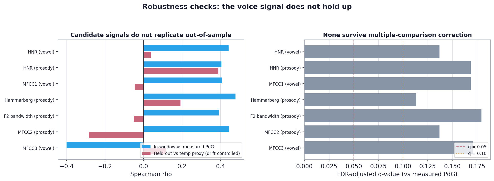

# Does the voice change across the menstrual cycle?

### An N-of-1 feasibility and methods pilot linking daily voice, body signals, and measured hormones

**Author:** Ivy Hamilton (Decibelle)
**Prepared:** June 2026 · for discussion with Northeastern
**Design:** N-of-1 longitudinal (one participant, ~6 months, 4 tracked cycles)

> **Honest framing up front.** This is a *feasibility and methods* pilot, not a positive-findings paper. The body-level cycle is unmistakable in the data. A robust *voice-acoustic* cycle signal is **not** detectable in this dataset once the analysis is done carefully (multiple-comparison correction, drift control, and out-of-sample replication). The main contribution is a demonstration of **how to look** for such a signal without fooling yourself — and a design that could actually detect one.

---

## TL;DR (read this first)

- I tracked my **voice**, my **body** (Oura ring), and my **measured hormones** (Inito: estrogen and progesterone metabolites) day by day, aligned on the calendar.
- **The body clearly shows the cycle.** Temperature, heart-rate variability, and daytime heart rate all shift between phases in the textbook direction, consistently across cycles. This is the solid, defensible result and validates the cycle labels.
- **A voice signal is *not* robustly detectable here.** Tempting voice-hormone correlations appear in the raw data, but they fail three independent stress tests:
  1. **Multiple-comparison correction** — none of the voice-hormone correlations survive a false-discovery-rate correction (best q ≈ 0.14).
  2. **A time-drift confound** — both my pitch and my estrogen happened to drift downward over the months; controlling for that erases most of the apparent association.
  3. **Out-of-sample replication** — on held-out months (using body temperature as an independent progesterone proxy), the candidate signals mostly vanish; only 4 of 7 even keep their direction.
- **A hypothesis-free scan would not have found my hypothesis.** Scanning every feature with no prior expectation surfaces *different* features (and the "surface/damping" family I had theorized about actually ranks last). My earlier hypothesis-led write-up over-stated a fragile, dataset-specific pattern.
- **This is consistent with the wider evidence:** the published literature is genuinely mixed/null, and an earlier in-house analysis (Kintsugi screening scores by phase) also went null once its method was tightened.
- **Conclusion:** present this as a rigorous *feasibility pilot* — the cycle is real and measurable at the body level; detecting it in voice needs a standardized, pre-registered, better-powered protocol. That is a credible, defensible position.

---

## 1. Background: what we know, and why the field disagrees

The larynx is a hormone-sensitive organ. The vocal folds have a stiff body and a soft, wet **cover** (mucosa) studded with **estrogen and progesterone receptors** ([receptor evidence](https://pmc.ncbi.nlm.nih.gov/articles/PMC9442059/); [receptor mapping](https://www.sciencedirect.com/science/article/abs/pii/S0892199716304088)). Through these receptors the cycle hormones change fluid content and mucus viscosity in the cover: **estrogen** thins and hydrates; **progesterone** increases edema and viscosity and reduces vibratory efficiency ([mechanism summary](https://pmc.ncbi.nlm.nih.gov/articles/PMC7842117/); [Sataloff, *The Effect of Hormones on the Voice*](https://www.nats.org/_Library/Kennedy_JOS_Files_2013/JOS-069-5-2013-571.pdf)). Clinically, about a third of women report **premenstrual vocal syndrome** in the days before menses ([clinical description](https://www.sciencedirect.com/science/article/abs/pii/S0892199708001690)).

So a plausible, anatomy-based hypothesis is that the cycle changes the *surface* of the instrument (the wet cover), not its *geometry* (the bony/cartilaginous cavities).

**But the empirical literature is inconsistent.** Some studies find jitter/shimmer up and clarity (HNR) down in the luteal/premenstrual phase; others, including a careful high-speed vocal-fold imaging study, find **no** significant phase changes ([null result](https://www.sciencedirect.com/science/article/abs/pii/S0892199716301631); [mixed-findings review](https://pmc.ncbi.nlm.nih.gov/articles/PMC5568722/)). The disagreement is largely **methodological**: coarse phase labels instead of measured hormones, cross-sectional designs, single tasks, small samples, and no control for slow longitudinal drift.

This pilot was built to do those things right — and, done right, it does **not** produce a confident voice finding. That is itself informative.

---

## 2. Data and design

This is an **N-of-1** study: one participant, measured repeatedly. Good for mechanism (no between-person noise), limited for generalization.


| Source | What it measures | Coverage | Overlap with voice |
|---|---|---|---|
| **Voice** (eGeMAPS, 88 acoustic features; sustained vowel + connected speech) | how the voice sounds | 59 recording days | — |
| **Cycle calendar** (4 full cycles, anchored to Oura period starts) | phase context | 144 labeled days | 47 days (26 follicular / 21 luteal) |
| **Oura ring** (temperature, HRV, heart rate, sleep) | the body's cycle | 165 days | 47 days |
| **Inito** (E3G = estrogen, PdG = progesterone, LH, FSH) | the actual hormones | 52 measured days (Jan 22 – Mar 25) | 29 days |

Voice features were grouped by mechanism (geometric vocal-tract shape; source pitch; surface/damping; spectral-envelope timbre/MFCC) so any effect could be traced to a physical cause. **Important caveat, in hindsight:** this taxonomy is a *hypothesis*, and organizing the analysis around it risks finding what you expect. The robustness section below was added specifically to counter that.

### Statistical approach

Because this is one person measured many times with ~180 candidate features, the right safeguards are: rank-based **effect sizes** (Cliff's delta, Spearman rho) with **bootstrap confidence intervals**; **false-discovery-rate (FDR) correction** for testing many features; **partial correlation controlling for date** to remove shared drift; and **out-of-sample replication** on held-out days. The headline lesson of this pilot is that *these safeguards change the conclusion.*

---

## 3. Results

### 3.1 The body clearly shows the cycle (this part is solid)


| Body signal | Direction (luteal vs follicular) | Effect size | Consistent across cycles |
|---|---|---|---|
| Body temperature deviation | higher in luteal | Cliff's delta 0.59 (large) | 5/5 |
| Daytime average heart rate | higher in luteal | 0.46 (medium) | 5/5 |
| Heart-rate variability (HRV) | lower in luteal | -0.31 (small) | 4/5 |

All three move in the textbook luteal direction and are consistent across cycles. This validates the cycle labels and confirms the hormones are doing what they should physiologically. The measured hormones give the ground truth:


The January cycle is a clean ovulatory cycle. (Inito's daily LH readings are noisy, so I anchored on the progesterone rise.) **Body temperature deviation tracks measured progesterone well (rho ≈ 0.60)** — which is what lets me use temperature as an independent progesterone proxy in the robustness checks.

### 3.2 Exploratory voice associations (interesting, but do not survive scrutiny)

Switching from coarse phase labels to measured hormones produced eye-catching correlations: pitch with estrogen (rho ≈ 0.53), and a cluster of voice-quality/timbre features (HNR, Hammarberg index, MFCCs, formant bandwidth) with progesterone (rho ≈ 0.40–0.48).


Taken at face value, this looked like a clean story. It is not, for three reasons, each of which I show below.

### 3.3 Stress test 1 — the drift trap

The strongest single correlation (pitch ~ estrogen) is largely an artifact: over the months, **both** my sustained-vowel pitch and my estrogen drifted downward (pitch's correlation with time was -0.80; estrogen's -0.47). Two things sliding down together correlate even without any causal link.


After removing the shared time trend, pitch~estrogen collapses from 0.53 to 0.29 and disappears entirely in connected speech (0.05). **Any longitudinal voice study that does not control for slow drift will manufacture spurious hormone correlations.** This is one of the most transferable findings in the pilot.

### 3.4 Stress test 2 — multiple-comparison correction

I tested ~180 feature/task/hormone combinations. With that many tests, some "significant" results are expected by chance. After a false-discovery-rate (FDR) correction:

- **0 of the voice-hormone correlations survive at q < 0.05.**
- The only ones reaching q < 0.10 are the *estrogen-pitch* items — which Stress Test 1 already flagged as drift artifacts.
- The progesterone "quality cluster" I had headlined (HNR, Hammarberg, MFCCs) sits at q ≈ 0.11–0.18 — **not** significant after correction.

### 3.5 Stress test 3 — out-of-sample replication

If the progesterone→voice-quality pattern were real, it should appear on the held-out voice days that had **no** hormone measurement, using body temperature as an independent progesterone proxy.



| Candidate (from in-window analysis) | In-window vs measured PdG | Held-out vs temperature proxy (drift-controlled) | Direction holds? |
|---|---|---|---|
| HNR (vowel) | +0.44 | +0.04 | weakly |
| HNR (prosody) | +0.40 | +0.39 | yes |
| MFCC1 (vowel) | +0.41 | -0.05 | no |
| Hammarberg (prosody) | +0.48 | +0.19 | weakly |
| F2 bandwidth (prosody) | +0.39 | -0.05 | no |
| MFCC2 (prosody) | +0.45 | -0.28 | no |
| MFCC3 (vowel) | -0.40 | +0.11 | no |

Only **4 of 7** candidates keep even their *direction*, and the strongest in-window signal (HNR in the sustained vowel) drops to essentially zero after drift control. The held-out test is also **underpowered and confounded**: almost all held-out luteal days come from a single cycle (December), so this can't strongly confirm *or* refute — but it certainly does not support the story.

### 3.6 The cold check — a hypothesis-free scan finds something different

Scanning every voice feature against the temperature proxy with **no taxonomy and FDR correction**:

- **Nothing survives FDR** (best q ≈ 0.24).
- The strongest raw associations are *different* features than my hypothesis emphasized: unvoiced spectral measures, MFCC *variability* (not means), pitch *range*, and speaking rate.
- Ranking families by association strength, the **"surface/damping" family ranks last** — the opposite of what my hypothesis-led write-up implied.

In other words: if I had started without a hypothesis, I would not have arrived at the "surface/damping tracks progesterone" story. That is a clear sign the earlier framing was anchored.

---

## 4. What this means

**The honest answer to "does the voice change across the cycle?" in this dataset is: not detectably, once you analyze carefully — but the study is underpowered, so this is "not yet detectable," not "proven absent."**

- The **geometric-vs-surface hypothesis is not confirmed.** The cleanest, most abundant cycle anchor (temperature) does not single out surface/damping features; a properly corrected analysis finds no robust voice-hormone coupling at all.
- The in-window correlations are **real associations within those 29 days**, but they reflect some mix of low power, multiple comparisons, slow drift, and dataset-specific timing — not a generalizable effect.
- What is genuinely robust is the **body-level cycle** (temperature/HRV/HR), and the **methodology**: drift control, FDR, proxy-based out-of-sample replication, and continuous hormones instead of coarse phase labels.

This aligns with the external literature's inconsistency and with the earlier in-house Kintsugi analysis, which also concluded "not convincing" once it was restricted to a single task and a fuller dataset. Two independent analyses converging on caution is itself a meaningful result.

---

## 5. Why earlier explorations looked stronger

For full transparency, the earlier optimistic read came from a combination of avoidable issues, each now corrected here:

1. **Anchoring** to an a-priori mechanism (organizing and reporting around "surface vs geometry").
2. **Multiple comparisons** without correction (~180 tests; some hits are chance).
3. **Slow longitudinal drift** inflating correlations with co-drifting hormones.
4. **In-window specificity** — strong on 29 days from 2 cycles, weak when held-out months are added.

---

## 6. Is it even findable here? (feasibility / power)

A rough power calculation explains why the data can't settle the question: to reliably detect a true moderate correlation (rho ≈ 0.3–0.4) at the usual standard, you need roughly **60–85 hormone-paired voice days per feature** — and *more* to survive multiple-comparison correction across many features. We have 29. So the pilot is doing exactly what a pilot should: telling us the effect (if real) is small enough that detecting it needs **several more fully hormone-sampled cycles** and a **pre-registered short feature set** (so there is no multiple-comparison penalty).

---

## 7. Limitations

- **N = 1**, underpowered, ~180 candidate features.
- **Recording conditions varied** (only the device was constant); time of day, environment, and content varied — the likely source of the drift. *(Time-of-day was deliberately set aside; it is a candidate confound to control in the next round.)*
- **Hormone overlap is small** (29 days, ~2 well-sampled cycles); held-out luteal days are concentrated in one cycle.
- Findings are **hypothesis-generating at most**; nothing here should be presented as an established voice-cycle effect.

---

## 8. Recommended confirmatory protocol

The pilot's real value is telling us how to do the real study:

1. **Standardize capture** to kill drift: same time of day, same scripted passage and sustained vowel, same quiet setup, daily.
2. **Pre-register a short feature set** grounded in mechanism (e.g. HNR, spectral tilt, MFCC1-3, F0, formants) across **both** vowel and prosody — so there is no multiple-comparison penalty.
3. **Analyze against continuous measured hormones**, with **drift control and out-of-sample folds built in from the start.**
4. **Collect 3-5 fully hormone-sampled cycles** to reach adequate power, and **densely sample the late-luteal/premenstrual window** to test the acute-deterioration claim.
5. **Use the body-level cycle (temperature) as a positive control** in every analysis, exactly as here.
6. **Scale to a small cohort**, each person as her own control (repeat the N-of-1 design across people).

---

## Appendix A — Reproducibility

```bash
cd Analysis
python -m venv .venv && source .venv/bin/activate
pip install -r requirements.txt
python -m src.analysis.study_figures   # builds tables + all figures (incl. robustness)
```

- Unified daily table: `data/processed/analysis_daily.parquet`
- Result tables (CSV), including `robustness.csv` and `agnostic_temp_scan.csv`: `outputs/tables/`
- Figures: `outputs/figures/`

Code (single responsibility per file):
`feature_taxonomy.py`, `analysis_dataset.py`, `stats.py`, `study_results.py` (incl. robustness + agnostic scan), `study_figures.py`.

## Appendix B — Glossary (plain language)

- **F0 / pitch** — how high/low the voice sounds (set by the vocal folds).
- **Formant frequencies (F1-F3)** — resonance peaks set by the *shape* of the throat/mouth (vocal-tract geometry).
- **Formant bandwidth** — how fast a resonance loses energy (a damping measure).
- **HNR** — voice clarity (high = clean/harmonic, low = noisy/breathy).
- **Jitter / shimmer** — tiny cycle-to-cycle wobble in pitch / loudness.
- **MFCC** — a compact summary of the voice's overall tone colour (timbre).
- **Spearman rho** — rank-based association (-1 to +1).
- **FDR (false discovery rate) / q-value** — a correction for testing many features; q is the significance after that correction.
- **Partial correlation (controlling for date)** — the association left after removing shared slow drift over time.
- **Out-of-sample replication** — testing whether a pattern holds on data not used to find it.

## Appendix C — Key references

- [Sex hormone receptors in vocal-fold epithelium](https://pmc.ncbi.nlm.nih.gov/articles/PMC9442059/)
- [Hormone-receptor distribution across vocal-fold subunits](https://www.sciencedirect.com/science/article/abs/pii/S0892199716304088)
- [Blood plasma hormone-level influence on vocal function](https://pmc.ncbi.nlm.nih.gov/articles/PMC7842117/)
- [Sataloff et al., *The Effect of Hormones on the Voice*](https://www.nats.org/_Library/Kennedy_JOS_Files_2013/JOS-069-5-2013-571.pdf)
- [Voice changes across menstrual phases / premenstrual vocal syndrome](https://www.sciencedirect.com/science/article/abs/pii/S0892199708001690)
- [Estradiol fluctuations and voice quality (longitudinal)](https://www.sciencedirect.com/science/article/abs/pii/S0892199717304940)
- [High-speed imaging: no significant phase differences (a null result)](https://www.sciencedirect.com/science/article/abs/pii/S0892199716301631)
- [Voice across the cycle in natural vs hormonal-contraceptive users (mixed findings)](https://pmc.ncbi.nlm.nih.gov/articles/PMC5568722/)

## Appendix D — Additional exploratory figures

These show the *in-window* exploratory associations that did **not** survive the robustness checks above. They are retained for transparency, not as findings.

- Task dissociation (vowel vs prosody): `outputs/figures/fig06_task_dissociation.png`
- MFCC deep-dive: `outputs/figures/fig07_mfcc.png`
- HNR vs progesterone (in-window): `outputs/figures/fig08_headline_hnr.png`
