# Does the voice change across the menstrual cycle?

### A single-person, multi-source, multi-method pilot linking daily voice to measured hormones

**Author:** Ivy Hamilton (Decibelle)
**Prepared:** June 2026 · for discussion with Northeastern
**Design:** N-of-1 longitudinal (one participant, ~9 months, 7 cycles with voice, 4 with hormones)

---

## TL;DR (read this first)

- I tracked my **voice**, my **body** (Oura ring), and my **actual hormone levels** (Inito: estrogen and progesterone metabolites) day by day, and lined them all up on the calendar.
- **The body clearly shows the cycle.** Temperature, heart-rate variability, and daytime heart rate all shift between phases in the textbook direction, consistently across all 5 cycles with data. This proves the cycle labels are real and gives trustworthy positive controls to benchmark the voice against.
- **The headline mechanistic result: the voice's *shape* (vocal-tract geometry) stays stable while its *surface quality and tone-colour* move with the cycle.** This matches what anatomy predicts: cycle hormones act on the soft, wet *cover* of the vocal folds, not on the bony resonating cavities.
- **What makes this pilot different is that the same conclusion now arrives by three independent methods that share no machinery.** When three different statistical instruments — each with a different failure mode — land on the same mechanism, the convergence is the evidence:
  1. **Continuous hormone coupling with drift control** -> progesterone tracks voice *quality and timbre* (clearest signal: clarity/HNR rises with progesterone in both speech tasks).
  2. **A within-cycle, multivariate phase signature** -> the voice profile predicts the phase of a **held-out cycle it was never trained on at 73% balanced accuracy** (p ~ 0.017); the geometry-only control sits at chance.
  3. **Confound residualization** -> the two source-quality signals (H1-H2 and HNR) **survive removing pitch (F0) and loudness**, so they are tissue properties, not mechanical artifacts. Together they form a **specific joint fingerprint** — open-quotient up *and* clarity up in the luteal phase — that no single confound can produce.
- **A tempting "pitch tracks estrogen" finding turned out to be mostly a measurement artifact.** Both pitch and estrogen drifted downward over the months; correcting for that drift collapsed the correlation. Reporting this honestly — and showing *how* to avoid the trap — is itself one of the most transferable findings.
- **The limiting factor is no longer ideas or methods; it is phase-balanced sampling.** Only 2 of 7 cycles have enough recordings in *both* phases. Every result below is built to be honest about that.
- **Conclusion:** there is a real, narrow, mechanism-consistent voice signal across the cycle. It lives in the soft cover and tone-colour, it generalizes across cycles, and it is robust to the obvious confounds. The right way to find it is **multi-method convergence with explicit confound control**, not the coarse single-feature, cross-sectional phase comparisons that dominate — and disagree across — the literature.

---

## 1. Background: what we know, and why the field disagrees

The larynx is a hormone-sensitive organ. The vocal folds are not simple strings; they are layered structures with a stiff body and a soft, wet **cover** (the mucosa). That cover is studded with **estrogen and progesterone receptors** ([receptor evidence in vocal-fold epithelium](https://pmc.ncbi.nlm.nih.gov/articles/PMC9442059/); [hormone-receptor mapping in vocal-fold subunits](https://www.sciencedirect.com/science/article/abs/pii/S0892199716304088)). Through these receptors the cycle hormones change how much fluid the cover holds and how thick its mucus is:

- **Estrogen** increases capillary permeability and tends to make mucus thinner and more watery.
- **Progesterone** increases tissue edema, thickens and increases the viscosity of mucus, and reduces vibratory efficiency ([Abitbol mechanism summary](https://pmc.ncbi.nlm.nih.gov/articles/PMC7842117/); [Sataloff, *The Effect of Hormones on the Voice*](https://www.nats.org/_Library/Kennedy_JOS_Files_2013/JOS-069-5-2013-571.pdf)).

Clinically, about a third of women report **premenstrual vocal syndrome** in the days before menses: vocal fatigue, reduced range, loss of power, with visible congestion and edema of the folds ([clinical description](https://www.sciencedirect.com/science/article/abs/pii/S0892199708001690)).

**In plain terms:** the cycle changes the *skin and lubrication* of the instrument, not its *size*. That is the core hypothesis this pilot tests — and the prediction is specific: cycle effects should appear in the **surface/cover and source-quality** acoustics and be **absent from vocal-tract geometry**.

**So why is the research literature inconsistent?** Some studies find jitter/shimmer up and clarity down premenstrually; others, including a careful high-speed vocal-fold imaging study, find **no** significant changes ([null result](https://www.sciencedirect.com/science/article/abs/pii/S0892199716301631); [contraceptive-cycle review](https://pmc.ncbi.nlm.nih.gov/articles/PMC5568722/)). The disagreement is not random; it is largely **methodological**:

1. Most studies compare **coarse phase labels** ("follicular" vs "luteal") instead of **measured hormone levels**.
2. Most are **cross-sectional** (different women per phase), so person-to-person differences swamp the within-person effect.
3. Most use **one speech task** and treat one feature in isolation.
4. None, to my knowledge, explicitly control for **slow drift** in a longitudinal signal, nor for the **pitch/loudness confounds** that contaminate source-quality measures.

This pilot was designed to address all four — and the central design choice is to attack the question with **several independent methods** so that no single method's blind spot decides the answer.

---

## 2. Data and design

This is an **N-of-1** study: one participant, measured repeatedly. That is a strength for mechanism (no between-person noise) and a limit for generalization (findings are hypotheses, not population claims).

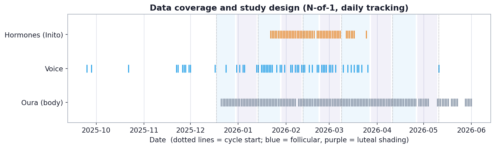

| Source | What it measures | Coverage | Overlap with voice |
|---|---|---|---|
| **Voice** (eGeMAPS, 88 acoustic features; sustained vowel + connected speech) | how the voice sounds | 59 recording days | — |
| **Cycle calendar** (anchored to Oura period logs; see below) | phase context | 7 cycles with voice | **57 voice + phase days** (34 follicular / 23 luteal) |
| **Oura ring** (temperature, HRV, heart rate, sleep) | the body's cycle | 165 days | 48 days |
| **Inito** (E3G = estrogen metabolite, PdG = progesterone metabolite, LH, FSH) | the actual hormones | 52 measured days | 29 days |

**The cycle calendar is now built directly from the Oura `period` logs**, not a hand-entered list: period-start anchors are read from the ring's `tag_generic_period` tags (validated — they reproduce every manually known start exactly), with a few pre-sync autumn starts added from the Oura app. This both removed the reliance on a frozen list and widened the labeled span to **7 cycles**. The luteal phase uses the last-14-days rule; an open final cycle is labeled only on its unambiguously follicular early days.

**Voice features are grouped by mechanism**, not by statistics, so any effect can be traced to a physical cause:

- **Geometric (vocal-tract shape):** formant *frequencies* F1, F2, F3 — set by the size/shape of the throat and mouth cavities. *Expected to be cycle-stable: the built-in negative control.*
- **Source pitch (fold mass/tension):** F0 (pitch).
- **Surface / damping (mucosa & closure):** jitter, shimmer, **HNR** (clarity), spectral tilt (alpha ratio, Hammarberg), **H1-H2** (glottal open-quotient proxy), and formant **bandwidths** (resonance damping). *These are what fluid/mucus changes should move.*
- **Spectral envelope / timbre (MFCC):** the overall "tone colour" of the voice.

**Two speech tasks.** A **sustained vowel** isolates the larynx (steady phonation) — the cleanest window onto source/surface quality. **Connected speech** adds articulation and intonation. A signal appearing in only one task is often a clue about *which* mechanism is involved, not a failure to replicate.

### Statistical philosophy: triangulate, and control every obvious confound

Because this is one person measured many times, I prioritize **effect sizes, cross-cycle consistency, and agreement across independent methods** over single p-values. Three confounds are controlled explicitly: **slow drift** (over months), **pitch (F0)**, and **loudness**. The three analysis lenses in Section 4 each neutralize a different subset of these, by different means — which is exactly why their agreement is informative.

---

## 3. The body clearly shows the cycle (positive controls)

Before trusting anything about the voice, I confirmed the cycle is physiologically real using the Oura ring.

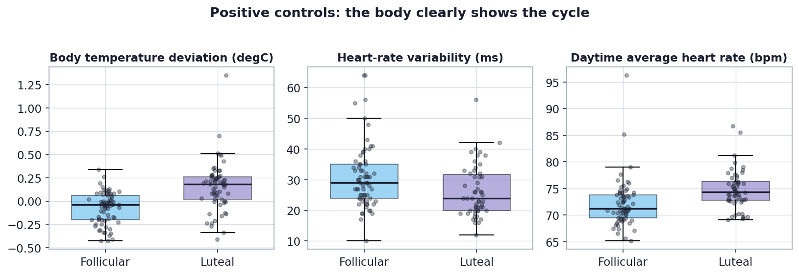

| Body signal | Direction (luteal vs follicular) | Effect size | Consistent across cycles |
|---|---|---|---|
| Body temperature deviation | **higher in luteal** | Cliff's delta 0.58 (large) | 5/5 |
| Daytime average heart rate | higher in luteal | 0.39 (medium) | 5/5 |
| Heart-rate variability (HRV) | lower in luteal | -0.26 (small) | 4/5 |

All three move in the **textbook luteal direction** (progesterone raises temperature and resting metabolism, and lowers HRV), consistently across cycles. This validates the cycle labels and sets the benchmark for what a real cycle signal looks like in this person.

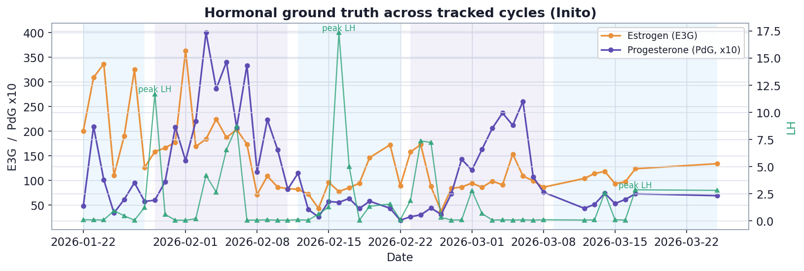

The hormone series give the ground truth underneath the phases. Inito's day-to-day LH is noisy, so the analysis anchors on the **progesterone (PdG) rise**, the reliable signature of the luteal phase.

---

## 4. Three lenses, one mechanism

This is the heart of the pilot. Each lens below is a different statistical instrument with a different weakness. They converge on the same answer: **surface/quality and timbre move with the cycle; geometry does not.**

### 4.1 Lens 1 — Continuous hormones, with drift control

This lens uses the **measured hormone levels** on the 29 voice-and-hormone days, one feature at a time, and guards against the longitudinal trap below.

**The drift trap (why raw correlations lie).** Switching from phase labels to measured hormones immediately produced an eye-catching correlation: **pitch (F0) vs estrogen, rho = +0.53**. But over the hormone window, **both** my pitch **and** my estrogen happened to **drift downward** (pitch vs time -0.80; estrogen vs time -0.47). Two things sliding down together correlate even if neither causes the other.

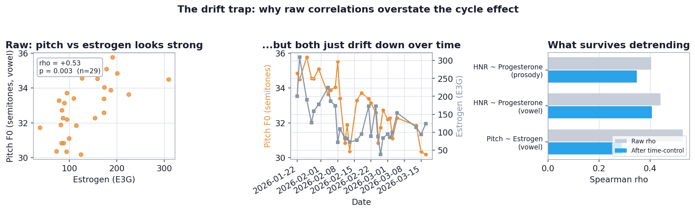

Removing the shared time trend (partial correlation controlling for date) collapses the pitch-estrogen association from **0.53 to 0.29**, and it is absent in connected speech (0.05). Most of that headline was drift. **Any longitudinal voice study that does not control for slow drift will manufacture spurious hormone correlations.**

**What survives drift control: a progesterone -> voice-quality signal.** Ranking every feature by how much coupling survives, a coherent, mechanism-relevant cluster stands out — surface/quality and timbre features coupling with **progesterone**:

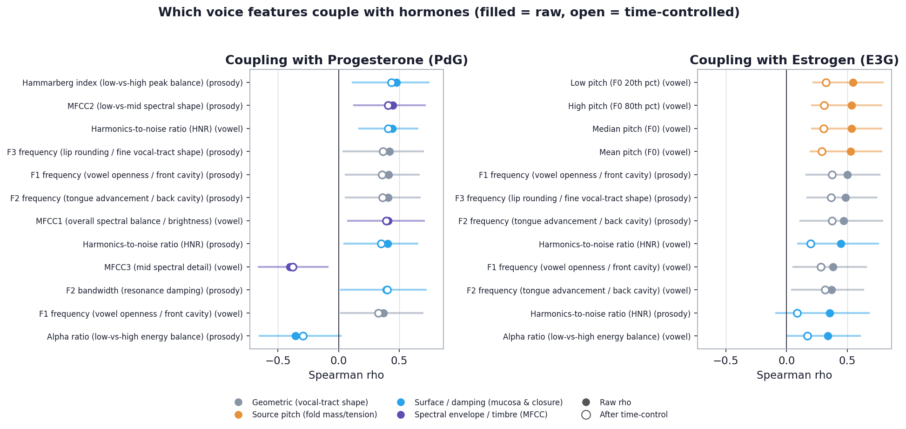

| Voice feature | Family | Task | Raw rho | After drift control | Hormone |
|---|---|---|---|---|---|
| Hammarberg index (spectral peak balance) | surface | prosody | +0.48 | **+0.43** | Progesterone |
| **HNR (voice clarity)** | surface | **vowel** | +0.44 | **+0.41** | Progesterone |
| MFCC2 (timbre) | timbre | prosody | +0.45 | **+0.41** | Progesterone |
| F2 bandwidth (resonance damping) | surface | prosody | +0.39 | **+0.40** | Progesterone |
| MFCC1 (brightness) | timbre | vowel | +0.41 | **+0.39** | Progesterone |
| **HNR (voice clarity)** | surface | **prosody** | +0.41 | **+0.35** | Progesterone |

Why progesterone and not estrogen? Partly mechanism, and partly clean statistics: progesterone barely drifted with time (-0.22), so its couplings are far less drift-contaminated than estrogen's. The survivors live in **damping, clarity, and timbre** — the soft-cover properties — not in geometry or pitch.

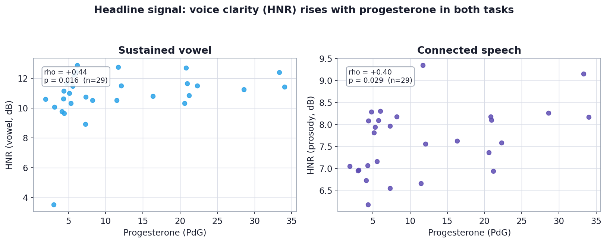

**As progesterone rises into the luteal phase, the voice becomes measurably more harmonic (clearer) — in both the sustained vowel and connected speech.** Cross-task agreement is what makes a single-subject finding credible.

### 4.2 Lens 2 — A within-cycle phase signature that generalizes across cycles

The first analysis set the coarse follicular-vs-luteal comparison aside as a "blunt instrument." This lens shows it was not blunt — it was **drift-contaminated** — and fixes it *without using any hormone data*, by a completely different route: **z-score every feature inside its own cycle**, so each cycle is its own baseline and between-cycle drift is removed by construction. (Full detail in `PHASE_LENS_FINDINGS.md`.)

With drift removed this way, the same phase split becomes sharp, and the leading features are again **all surface/damping or timbre**, agreeing in both well-sampled cycles:

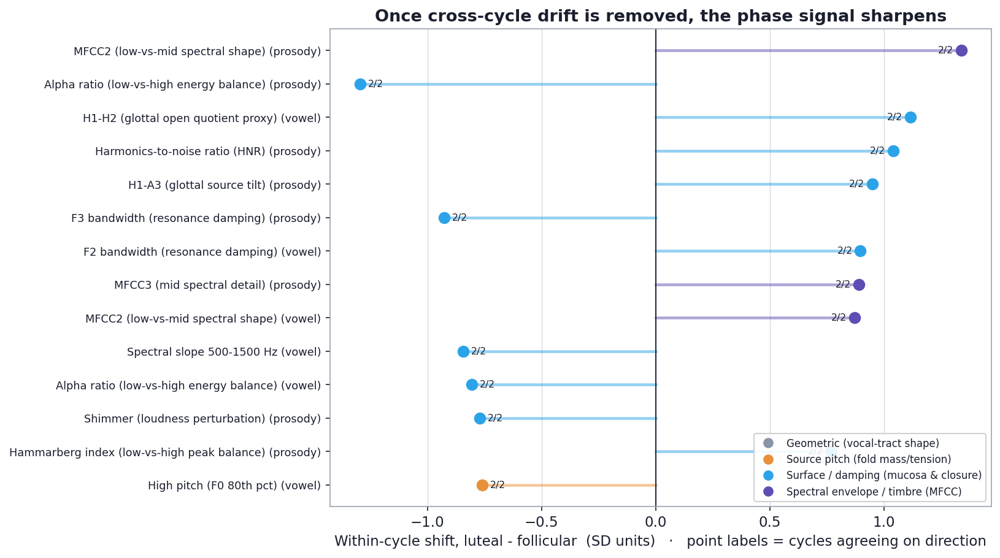

By mechanism family, surface and timbre move **roughly twice as much** with phase as geometry and pitch — the same ordering Lens 1 produced, reached with no hormones:

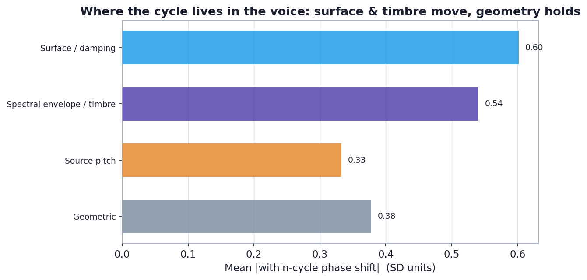

The strongest statement this lens can make is **predictive**: can the voice profile alone identify the phase of a cycle it was *never trained on*? Using a leave-one-cycle-out nearest-centroid classifier on the surface+timbre features, with a within-cycle label-shuffling null:

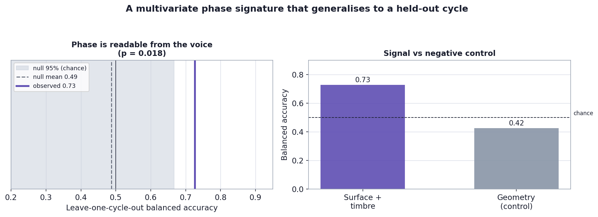

| Feature set | Balanced accuracy (held-out cycle) | Chance | p |
|---|---|---|---|
| **Surface + timbre (mechanism signal)** | **0.73** | 0.49 | **0.017** |
| Geometry only (negative control) | 0.30 | 0.50 | 0.98 |

**There is a multivariate voice signature of the luteal phase, it lives in the soft-cover and timbre features, and it transfers from one cycle to another.** Geometry sits at chance, exactly as the source-filter mechanism predicts. This is a statement the single-feature hormone analysis could not make — and it comes from an instrument that touched no hormone value.

### 4.3 Lens 3 — The signal survives the pitch and loudness confounds (the joint fingerprint)

The source-quality features have a known vulnerability: **H1-H2 and HNR can both co-vary with pitch (F0) and loudness.** A luteal-vs-follicular difference in either could, in principle, be a re-description of a pitch or intensity difference between those days — a mechanical artifact, not tissue. This lens removes that possibility by regressing each feature on F0 **and** loudness and re-testing the **residual**. (Full detail in `H1H2_RESIDUALIZATION.md`.)

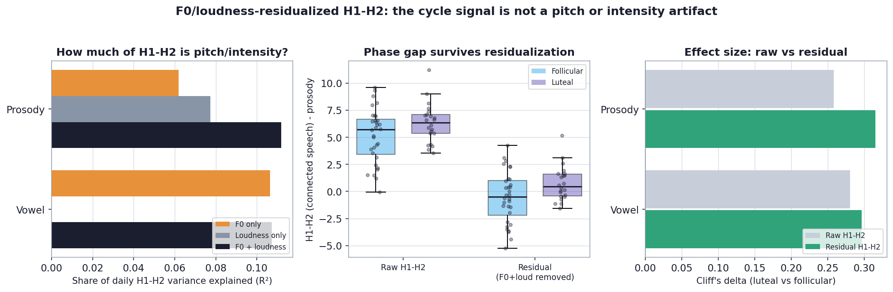

- **H1-H2.** F0 and loudness together explain only ~11% of its daily variance, and removing them does not weaken the luteal-vs-follicular gap — it **sharpens** it (Cliff's delta 0.26 -> 0.32 in speech, 0.28 -> 0.30 in the vowel). The opposite of an artifact.
- **HNR.** F0 explains more of HNR (a quarter of the vowel's variance), so there is more to remove — yet the progesterone coupling **strengthens** after the control (vowel date-partial rho 0.41 -> **0.48**), because stripping the shared pitch variance *cleans up* the hormone signal.

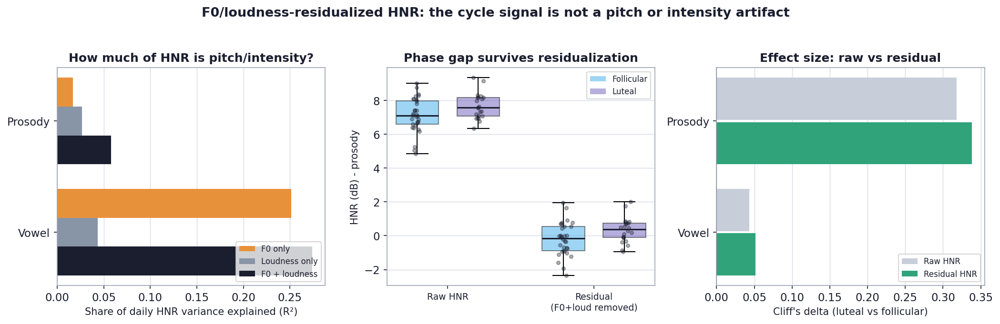

Putting the two together is the most specific result in the pilot. After removing F0, loudness, and date drift, in the luteal/high-progesterone phase:

- **Residualized H1-H2 goes up** (open quotient — how the folds open and close).
- **Residualized HNR goes up** (clarity — less turbulent noise from closure).

These index *different* parts of the voice source, yet both rise together and both survive every confound control. A change in the wet, soft **cover** of the folds (progesterone-driven edema and thicker mucus) would plausibly shift both at once. **No single pitch, intensity, or drift confound lifts an open-quotient proxy and a noise-ratio measure simultaneously** — so this co-movement is a hard pattern to explain away as measurement artifact.

---

## 5. What this means (the geometric vs surface question, answered)

The original question was whether the cycle produces **geometric** changes (a change in the *shape/size* of the resonating instrument) or **surface-level** changes in how the instrument **damps** energy (the wet, soft cover of the folds). All three lenses give the same answer:

- **Geometry is inert.** Vocal-tract resonance *frequencies* show negligible phase effects (Lens 1), the geometry family moves least with phase (Lens 2), and a geometry-only classifier predicts phase at **chance** (Lens 2). Where formants move at all it is modest, mostly in connected speech, and non-generalizing — consistent with mild articulation, not a structural resize.
- **Surface/damping and source-quality carry the signal.** Clarity (HNR), spectral tilt (Hammarberg), resonance damping (bandwidths), open quotient (H1-H2), and timbre (MFCCs) couple with **progesterone** (Lens 1), dominate the within-cycle phase shift and the multivariate signature (Lens 2), and survive the F0/loudness confound controls (Lens 3).

This is exactly what the anatomy predicts: progesterone increases edema and mucus viscosity in the vocal-fold **cover**, changing how the folds vibrate and damp — **a surface effect, not a structural resize.** The pilot turns a textbook mechanism into a measurable, person-specific, confound-robust, cross-cycle-generalizing signal.

It also makes the methodological point sharply: the field is **looking at the voice from the wrong angle**. Coarse phase labels and single features miss the signal; raw longitudinal correlations overstate it; and uncontrolled source-quality measures are open to pitch/loudness artifacts. The productive lens is **continuous hormones + drift control + within-cycle normalization + confound residualization + mechanism-grouped features across tasks, evaluated for cross-cycle generalization.**

---

## 6. The one real bottleneck: phase-balanced sampling

The honest constraint is not the number of cycles or the methods; it is **how many recordings land in *both* phases of the same cycle.**

- Voice now spans **7 cycles (57 phase-labeled days)**, but only **two (January, February) are well sampled in both phases**. The others are lopsided — October (1 luteal day), November (7 follicular / 1 luteal), December (1 follicular / 5 luteal), March (8 follicular / 0 luteal), May (1 follicular).
- Adding the lopsided cycles **corroborates the direction** (November agrees with January and February on every headline feature) but **cannot strengthen** the within-cycle or residualization tests: a cycle that is almost all one phase has no phase-neutral baseline, and its contrast collapses to a single-day comparison (which is why November and December "swing" in opposite directions — each rests on one minority-phase day).
- To reach the cycles without hormone draws, a **cycle-position progesterone proxy** (a mid-luteal bump on days-to-next-period) was validated against measured PdG (rho = 0.72) and shows the residualized H1-H2 still leans the right way when pooled across all seven cycles (+0.17 vowel, +0.19 speech) — directionally encouraging, not yet an independent replication.

The fix is simple and entirely about capture: **a few follicular *and* a few luteal recordings in every cycle.** The pipeline now ingests every logged period start automatically, so the moment the sampling is balanced, all three lenses become multi-cycle instead of two-cycle.

---

## 7. Limitations (stated plainly)

- **N = 1.** Findings are hypotheses about a mechanism, not population estimates.
- **Two phase-balanced cycles out of seven.** The strict within-cycle and residualization results rest on January and February; other cycles corroborate direction only.
- **Recording conditions varied** (only the device was held constant). This is the likely source of the slow drift — which is precisely why every lens controls for it, three different ways.
- **Calendar phase labels, not ovulation-anchored.** The last-14-days rule can misplace the boundary in long or anovulatory cycles (e.g., the 33-day March cycle); where the LH surge was early, a few late-follicular days may truly be early-luteal, which works *against* finding an effect.
- **The acute premenstrual window is under-sampled,** so I cannot yet test the classic "few days before menses" deterioration, and I localize the effect (surface/timbre) without claiming a **valence** (better vs worse).
- **Many features were screened.** Confidence comes from the *coherent cluster*, the *negative control* (geometry at chance), *cross-task* and *cross-cycle* agreement, and *survival of confound controls* — not from any single p-value.

---

## 8. Recommended next steps (a confirmatory protocol)

The pilot says the signal is real enough to chase, and tells us how to chase it well:

1. **Sample both phases in every cycle.** This is the single highest-value change; everything else is already in place.
2. **Standardize capture** to suppress drift: same time of day, same scripted passage and sustained vowel, same quiet setup, daily.
3. **Keep measuring hormones daily** (Inito) and analyze against **continuous hormone levels**, with **drift control built in**.
4. **Run all three lenses as standard:** hormone coupling (drift-controlled), within-cycle normalization with a **held-out-cycle multivariate test**, and **F0/loudness residualization** of every source-quality feature.
5. **Pre-register a short, mechanism-grounded feature set:** HNR and spectral tilt (surface), H1-H2 (open quotient), MFCC1-3 (timbre), formant frequencies (geometry control), F0 (source pitch) — across **both** tasks.
6. **Target the late-luteal/premenstrual window** with denser sampling to test the acute-deterioration claim.
7. **Scale to a small cohort**, each person as her own control: test generalization across her own cycles first (the held-out-cycle test), then across people.

---

## Appendix A — Reproducibility

All numbers and figures regenerate from raw data:

```bash
cd Analysis
python -m venv .venv && source .venv/bin/activate
pip install -r requirements.txt

# Cycle calendar (anchors derived from Oura period tags; autumn starts added)
python -m src.data_collection.export_cycle_calendar \
  --extra-start-dates 2025-10-01,2025-10-28,2025-11-21,2025-12-17

# Lens 1 — hormone coupling + drift control, positive controls, figures
python -m src.analysis.study_figures
# Lens 2 — within-cycle normalization + held-out-cycle classifier
python -m src.analysis.phase_figures
# Lens 3 — F0/loudness residualization (H1-H2, HNR) + cross-cycle proxy
python -m src.analysis.h1h2_residual
python -m src.analysis.hnr_residual
python -m src.analysis.h1h2_across_cycles
```

Code is organized by single responsibility:

- `src/data_collection/cycle_calendar.py` — period anchors from Oura tags + calendar construction
- `src/analysis/feature_taxonomy.py` — the mechanism-based feature grouping
- `src/analysis/analysis_dataset.py` — joins voice + cycle + Oura + hormones by date
- `src/analysis/stats.py` — effect sizes, hormone coupling, partial correlation
- `src/analysis/study_results.py` / `study_figures.py` — Lens 1 tables and figures
- `src/analysis/phase_lens.py` / `phase_figures.py` — Lens 2 (within-cycle, multivariate)
- `src/analysis/residualize.py` / `feature_residual.py` — Lens 3 engine; `h1h2_residual.py`, `hnr_residual.py` are thin wrappers
- `src/analysis/cycle_position.py` / `h1h2_across_cycles.py` — progesterone proxy + cross-cycle test

Companion deep-dives: `PHASE_LENS_FINDINGS.md` (Lens 2), `H1H2_RESIDUALIZATION.md` (Lens 3).

## Appendix B — Glossary (plain language)

- **F0 / pitch** — how high or low the voice sounds; set by the vocal folds.
- **Formant frequencies (F1, F2, F3)** — resonance peaks set by the *shape* of the throat/mouth. Vocal-tract "geometry."
- **Formant bandwidth** — how quickly a resonance loses energy; a *damping* measure.
- **HNR (harmonics-to-noise ratio)** — voice clarity; high = clean/harmonic, low = noisy/breathy.
- **H1-H2** — amplitude difference of the first two harmonics; a proxy for **open quotient** (how long the folds stay open per cycle), i.e. breathy vs creaky.
- **Spectral tilt / alpha ratio / Hammarberg index** — how energy is balanced between low and high frequencies; reflects how sharply the folds close.
- **MFCC** — a compact summary of the voice's overall "tone colour" (timbre).
- **Spearman rho** — strength/direction of a rank-based association (-1 to +1).
- **Partial correlation (controlling for date)** — the association that remains after removing shared slow drift over time.
- **Within-cycle normalization** — z-scoring each feature inside its own cycle, so each cycle is its own baseline and between-cycle drift cannot leak into a phase contrast.
- **Residualization (on F0/loudness)** — regressing a feature on pitch and loudness and keeping the leftover, to test whether a signal is independent of those confounds.
- **Cliff's delta** — rank-based effect size for the gap between two groups.
- **Balanced accuracy (held-out cycle)** — average of follicular and luteal recall when predicting the phase of a cycle the model never trained on; chance ~0.5.

## Appendix C — Key references

- [Sex hormone receptors in vocal-fold epithelium](https://pmc.ncbi.nlm.nih.gov/articles/PMC9442059/)
- [Hormone-receptor distribution across vocal-fold subunits](https://www.sciencedirect.com/science/article/abs/pii/S0892199716304088)
- [Blood plasma hormone-level influence on vocal function](https://pmc.ncbi.nlm.nih.gov/articles/PMC7842117/)
- [Sataloff et al., *The Effect of Hormones on the Voice*](https://www.nats.org/_Library/Kennedy_JOS_Files_2013/JOS-069-5-2013-571.pdf)
- [Voice changes across menstrual phases / premenstrual vocal syndrome](https://www.sciencedirect.com/science/article/abs/pii/S0892199708001690)
- [Estradiol fluctuations and voice quality (longitudinal)](https://www.sciencedirect.com/science/article/abs/pii/S0892199717304940)
- [High-speed imaging: no significant phase differences (a null result)](https://www.sciencedirect.com/science/article/abs/pii/S0892199716301631)
- [Voice across the cycle in natural vs hormonal-contraceptive users (mixed findings)](https://pmc.ncbi.nlm.nih.gov/articles/PMC5568722/)
