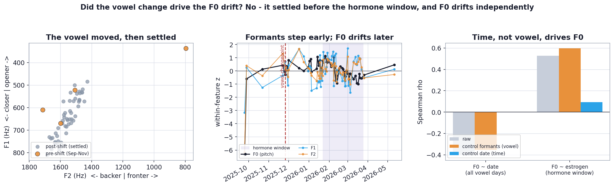

# Did changing the sustained vowel cause the F0 drift?

### Testing whether an articulatory technique change (an "ah" -> "uh" shift) explains the pitch drift

**Author:** Ivy Hamilton (Decibelle)
**Prepared:** June 2026 · validity check for `VOICE_CYCLE_FINDINGS.md`
**Design:** N-of-1 longitudinal (one participant, daily voice + hormones)

---

## TL;DR

- **The concern:** partway through the study I produced the sustained vowel differently (a deliberate quality change after reading about cardinal vowels). A vowel change is an *articulatory* change, so I worried it had caused the slow **F0 (pitch) drift** that inflated the raw pitch-estrogen correlation in the main report.
- **The test:** a vowel change writes itself into the **formant frequencies** (F1/F2/F3 = vocal-tract shape). So I checked *when* the formants shifted, whether they move *with* F0 inside the hormone window, and whether controlling F0 for the formants removes the drift.
- **The result:** the vowel change is **real but early** - a clean regime shift in F1/F2/F3 that a changepoint scan dates to **~26 November 2025**. Only **2 phase-labeled days** fall before that settle date (both in lopsided early cycles that the phase analysis excludes anyway), and **0** hormone days do. Inside the hormone window (Jan 22 - Mar 25) the **formants are flat** (F1 rho -0.15, F2 +0.06, F3 +0.13, all n.s.) while **F0 drifts hard** (rho **-0.78**). Controlling F0 for the formants does **nothing** (F0~date -0.40 -> -0.35; F0~estrogen +0.53 -> +0.60). Only controlling for **time** removes it (F0~estrogen +0.53 -> **+0.09**).
- **Conclusion:** the vowel change is a **red herring** for the cycle result. It settled before the hormones were measured, and the F0 drift is independent of it. The main report's date-control is the correct fix; formant-residualization would not have helped (and would have slightly *strengthened* the spurious pitch-estrogen link).



---

## 1. Why the formants are the right place to look

F0 (pitch) is set by the vocal folds; the **vowel** you produce is set by the vocal-tract shape, which is read out by the **formant frequencies** F1, F2, F3. So "I said ah and later uh" is a testable claim: if true, F1/F2/F3 must shift over time. F0 and vowel identity are physically separable, which is exactly what lets us ask whether one caused the other.

For reference, opener vowels raise F1; fronter vowels raise F2. The panel-A vowel chart uses the usual convention (F1 increasing downward, F2 increasing leftward).

## 2. Timing: the vowel moved during warm-up, then settled

Monthly medians of the sustained-vowel formants show a clear early regime shift:

| Month | F1 (Hz) | F2 (Hz) | F3 (Hz) | F0 (semitones) |
|---|---|---|---|---|
| 2025-09 | 503 | 1197 | 2054 | 23.6 |
| 2025-10 | 522 | 1506 | 2680 | 33.1 |
| 2025-11 | 655 | 1563 | 2790 | 33.4 |
| 2025-12 | 719 | 1606 | 2804 | 33.4 |
| 2026-01 | 638 | 1541 | 2793 | 34.6 |
| 2026-02 | 628 | 1540 | 2808 | 33.2 |
| 2026-03 | 703 | 1615 | 2842 | 31.6 |

A single-changepoint scan dates the F1/F2/F3 shift to **~2025-11-26**. Crucially:

- The hormone window runs **2026-01-22 to 2026-03-25** - entirely **after** the vowel settled.
- Only **2** of the 57 phase-labeled days fall before the settle date, and **0** of the 29 hormone days do. (After earlier period starts were added to the calendar, the once-"warm-up" days now sit inside the October and November cycles - but those cycles are too phase-lopsided to enter the within-cycle contrast, and the *between-cycle* vowel drift is removed by within-cycle normalization in the phase lens. Either way the vowel change touches neither the hormone coupling nor the phase-balanced cycles.)

## 3. Independence: inside the hormone window, the vowel is stable but F0 is not

Spearman correlation with date, restricted to the hormone window (n = 33 vowel days):

| Feature | rho with date (in window) | Reading |
|---|---|---|
| **F0 (pitch)** | **-0.78** | strong drift |
| F1 | -0.15 (n.s.) | vowel stable |
| F2 | +0.06 (n.s.) | vowel stable |
| F3 | +0.13 (n.s.) | vowel stable |
| loudness | -0.29 | softening |

A vowel that is not moving cannot be moving F0. Whatever is pulling pitch down over Jan-Mar, it is **not** a change in vowel articulation.

## 4. Control: residualizing F0 on the vowel does nothing; time control removes the drift

If the vowel were the confound, regressing F0 on the formants should flatten the drift. It does not:

| Association | Raw | Control formants (vowel) | Control date (time) |
|---|---|---|---|
| F0 ~ date (all vowel days) | -0.40 | **-0.35** | - |
| F0 ~ estrogen (hormone window) | +0.53 | **+0.60** | **+0.09** |

Controlling for the vowel leaves the F0 drift and the F0-estrogen correlation essentially unchanged (the estrogen link even edges *up*). Controlling for **date** collapses the F0-estrogen correlation to near zero - reproducing the main report's "drift trap" finding. The confound is **time**, not **vowel**.

## 5. So what *is* the F0 drift, and how should it be handled?

- The drift is a genuine **slow decline in pitch over Jan-Mar** that happens to parallel the seasonal/temporal decline in estrogen. It is accompanied by a softening in loudness. Likely contributors: growing comfort/relaxation with the daily task, vocal warmth/fatigue, time-of-day, or environment - none of them hormonal, and none of them captured by an articulatory feature.
- **The right adjustment is the one already in the main report: partial out date** (or any explicit slow-drift covariate). That is what removed the spurious pitch-estrogen correlation.
- **Do not residualize F0 on formants.** For F0 it removes nothing (F0 is independent of vowel identity here), and inside the hormone window it would slightly *inflate* the spurious estrogen link. Formant-residualization is the correct tool only for features that genuinely depend on vowel identity (spectral tilt, MFCCs, H1-H2) - and only in the pre-Dec era, which the cycle analyses already exclude.

## 6. How to adjust for technique drift in general (for the next round)

The instinct - "my technique drifted, and drift contaminates a longitudinal voice study" - is exactly right, even though this particular vowel change turned out to be pre-window. The defenses, in order:

1. **Prevent it.** Standardize the task: one fixed target vowel (e.g. sustained /a/), a reference pitch and loudness cue, same time of day, same quiet setup, daily. This is the real fix.
2. **Segment by regime.** Detect changepoints in articulatory features (F1/F2) and analyze within a stable regime. The cycle analyses already do this implicitly by starting after the vowel settled.
3. **Residualize per feature against its genuine confounds** (e.g. spectral tilt / MFCCs on the formants; H1-H2 on F0 and loudness, as in `H1H2_RESIDUALIZATION.md`), not against a one-size confound.
4. **Keep date-partialling** for any residual slow drift that no measured covariate captures - which is what the F0 drift turned out to be.

---

## Limitations

- **Single changepoint, monthly medians.** The warm-up period is sparsely sampled (10 days across Sep-Nov), so the exact settle date is approximate; the conclusion (settled before Dec 18) is robust to that.
- **Acoustic, not phonetic, labels.** The formants confirm an articulatory shift but do not certify the exact phoneme; the participant's "ah/uh" labels need not map one-to-one to IPA. The argument only needs that the vowel *changed and then stabilized*, which the formants show.
- **N = 1.** As with the whole pilot, this validates the reasoning for this dataset, not a population claim.

---

## Appendix - Reproducibility

```bash
cd Analysis
source .venv/bin/activate
python -m src.analysis.vowel_drift
```

- Diagnostic (computation + figure): `src/analysis/vowel_drift.py`
- Residualization helper (shared): `src/analysis/residualize.py`
- Summary table: `outputs/tables/vowel_drift_summary.json`
- Figure: `outputs/figures/fig12_vowel_drift.png`
